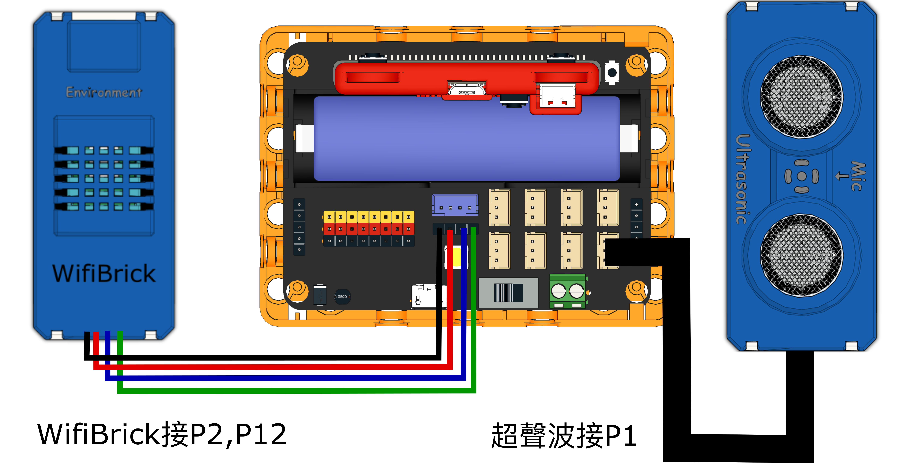

# 3. 座地前伸

以超聲波測距檢測用戶座地前伸的距離，然後上傳至物聯網平台。

## 搭建說明書

[搭建說明書下載]()

## 參考接線

### 感應器

## 參考程式

### 感應器

[感應器參考程式下載](https://makecode.microbit.org/_Vgdgqe0kxJk5)

### 控制器

[控制器參考程式下載](https://makecode.microbit.org/_5aifcuU6xgW6)