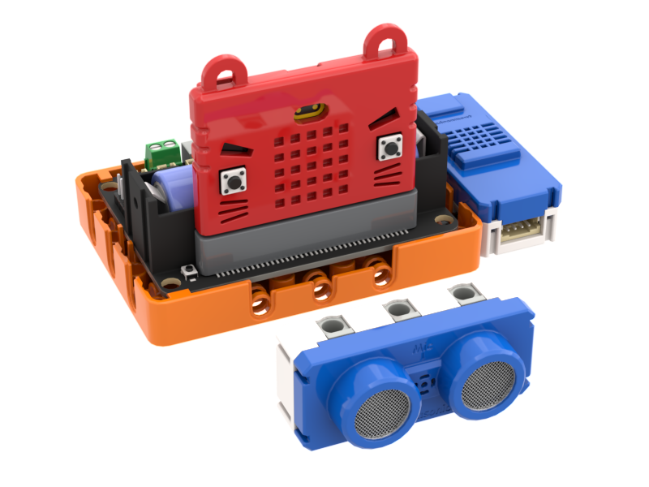
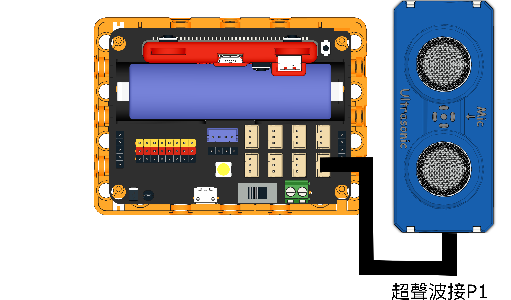
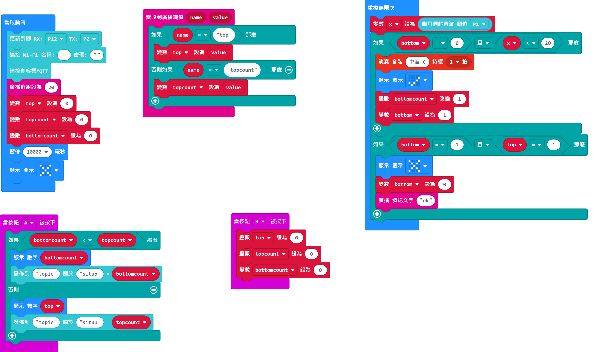

# 2. 臥仰起坐測試

以超聲波測距檢測用戶完成臥仰起坐的次數，然後上傳至物聯網平台。

## 搭建說明書

[搭建說明書下載]()

## 參考接線

### 臥仰起坐(下感應器)

### 臥仰起坐(上感應器)

## 參考程式

### 臥仰起坐(下感應器)參考程式

[臥仰起坐(下)參考程式下載](https://makecode.microbit.org/_Lax55gFC03iT)

### 臥仰起坐(上感應器)參考程式

[臥仰起坐(上)參考程式下載](https://makecode.microbit.org/_JkjfXiiFgUuk)