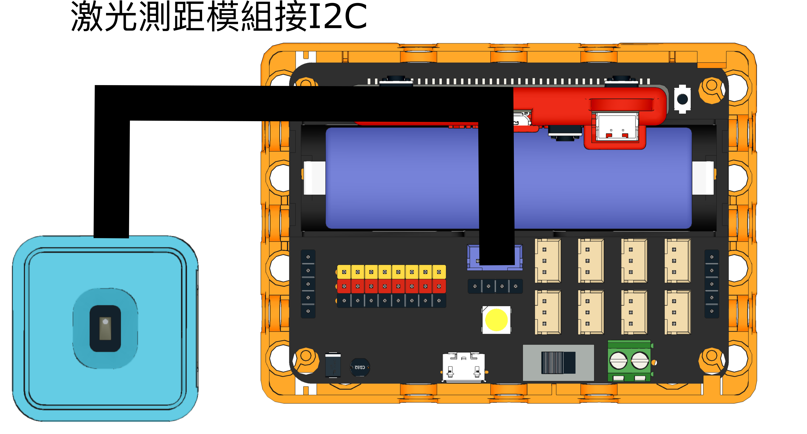
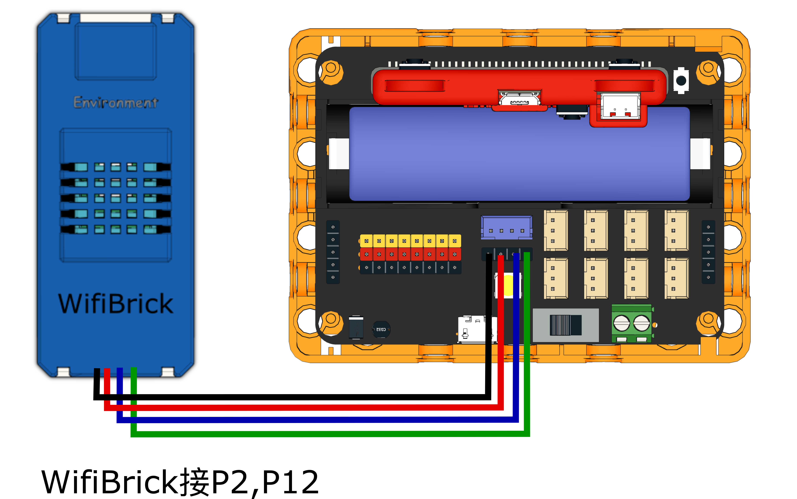
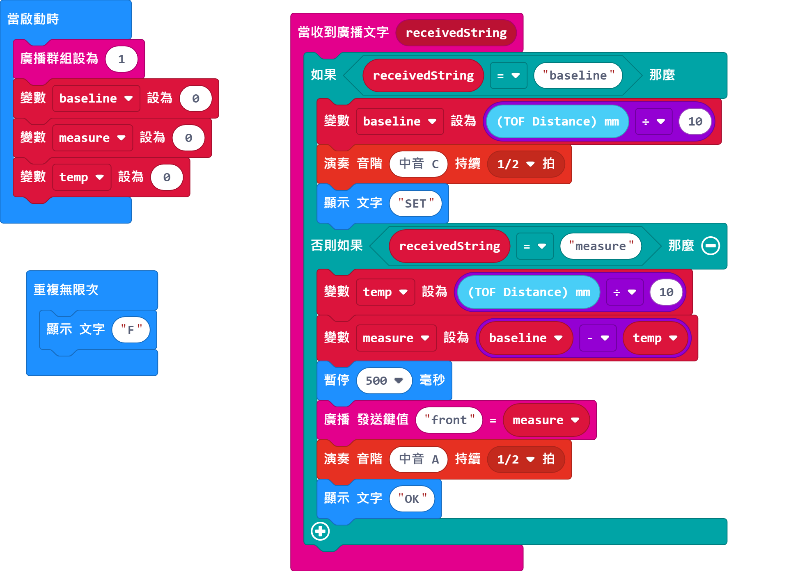
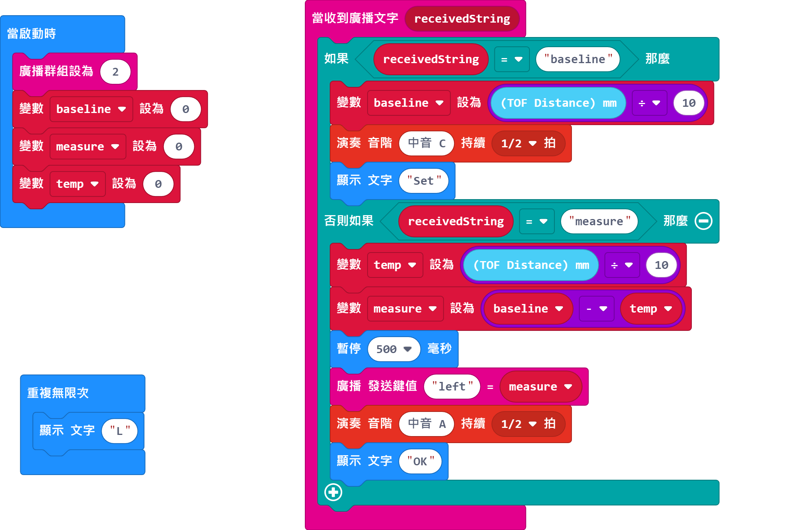
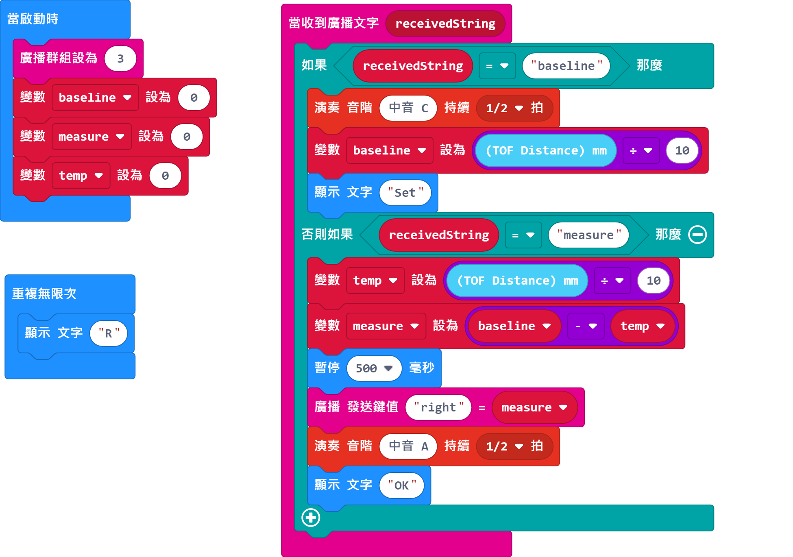
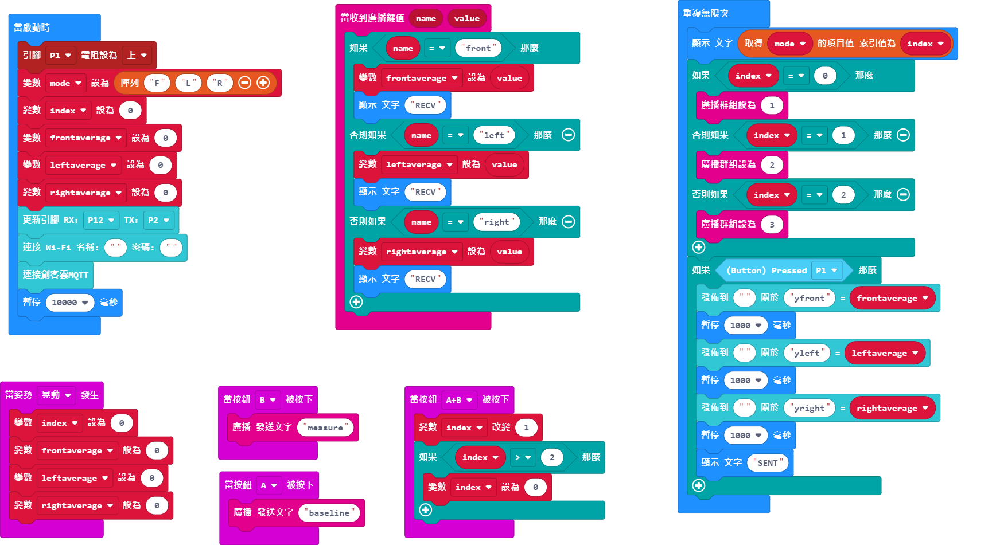

# 4. Y平衡測試

以超聲波測距檢測用戶Y平衡的距離，然後上傳至物聯網平台。

## 搭建說明書

[搭建說明書下載]()

## 參考接線

### 感應器

### 感應器(控制器)

## 參考程式

### 感應器(前)

[感應器(前)參考程式下載](https://makecode.microbit.org/_Tf63UpRzp9xK)

### 感應器(左)

[感應器(左)參考程式下載](https://makecode.microbit.org/_K3Jhvx9qDLRE)

### 感應器(右)

[感應器(右))參考程式下載](https://makecode.microbit.org/_Y3mKwmWcxiey)

### 感應器(控制器)

[感應器(控制器)參考程式下載](https://makecode.microbit.org/_TUKAEaFcqdVM)

## 使用方法

1. 在地上用膠紙貼一個大型的Y字樣(每邊長度大約1m)。
2. 在每條線的盡頭放上相應的感應器(前\左\右)。
3. 用戶需要先在Y的中心點企直並在用戶每邊放一個小盒子。
4. 感應器量度的次序為前、左、右。
5. 在控制器上按下A，量度起始距離，相應的感應器會顯示set。
6. 用戶用腳將盒子沿線段推動，當推到盡頭後就可以按下遙控器B鍵量度距離。控制器會顯示recv代表量度完畢。
7. 同時按下A+B鍵，切換到下一組感應器。控制器與相應的感應器會顯示相同英文字母。
8. 重複直至完成測量前、左、右的距離，最後按下按鍵模組，將數據上傳到物聯網。
