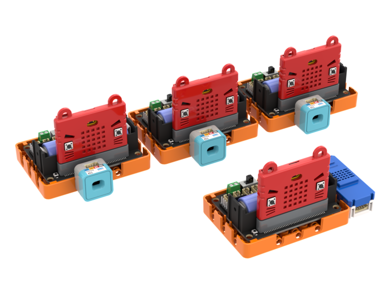

# 4. Y平衡測試

以超聲波測距檢測用戶Y平衡的距離，然後上傳至物聯網平台。

## 搭建說明書

[搭建說明書下載]()

## 參考接線

### 感應器

### 感應器(控制器)

## 參考程式

### 感應器(前)

[感應器(前)參考程式下載](https://makecode.microbit.org/_Tf63UpRzp9xK)

### 感應器(左)

[感應器(左)參考程式下載](https://makecode.microbit.org/_K3Jhvx9qDLRE)

### 感應器(右)

[感應器(右))參考程式下載](https://makecode.microbit.org/_Y3mKwmWcxiey)

### 感應器(控制器)

[感應器(控制器)參考程式下載](https://makecode.microbit.org/_TUKAEaFcqdVM)