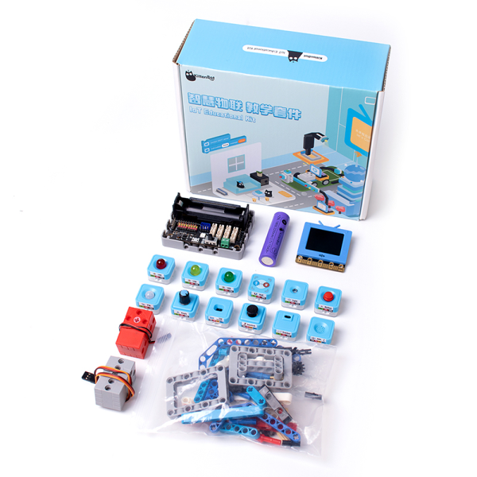

# 未來板IoT發明家套件

未來板IoT發明家套件是以未來板為主控的教學套件，針對IoT與智能家居與智能交通而設計的教學套件。內容貼近現實生活，充滿趣味性、實用性和知識性，幫助學生輕易理解IoT與智能城市的應用。套件包含10款IoT智慧城市的應用實例，令學生可以緊貼科技發展，激發創造力。

## 產品特色

1. 未來板的彩屏可以引起學生興趣，在16節課程中由零開始學習編程
2. 套件大約10種應用案例，內容全部圍繞生活原理，智能家居及物聯網等，內容緊貼時代並讓學生容易將知識與日常生活連結起來
3. 動手搭建各種應用項目，配合簡易的編程，令學生更全面輕易地了解物聯網的概念並且激發創客精神

## 產品參數

- 套件尺寸：205 x 182 x 75 mm
- 重量：600 g

## 套件內容

- 未來板 x1
- Robotbit Edu擴展板 x1
- Robotbit底座 x1
- 18650鋰電池 x1
- Sugar LED 模組 x3
- Sugar 按鍵模組 x1
- Sugar 光敏模組 x1
- Sugar 巡線模組 x1
- Sugar 磁力感應模組 x1
- Sugar 溫濕度探測模組 x1
- Sugar 人體紅外線模組 x1
- Sugar 搖桿模組 x1
- Sugar 激光測距模組 x1
- GeekServo 2KG灰色舵機 x1
- GeekServo 2KG紅色電機 x1
- 塑膠積木包 x1
- 裝飾結構紙板 x3
- 3Pin 連接線 x6
- 4Pin 連接線 x2
- USB線 x1

