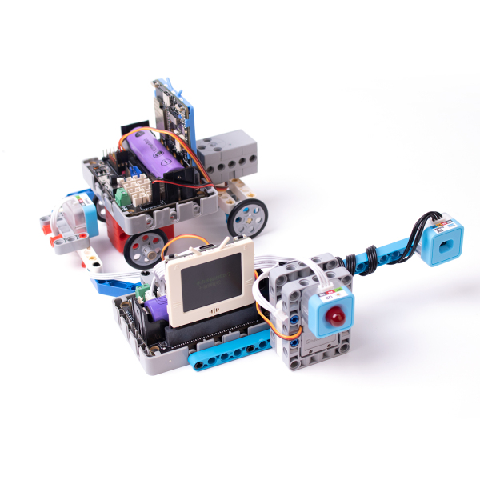
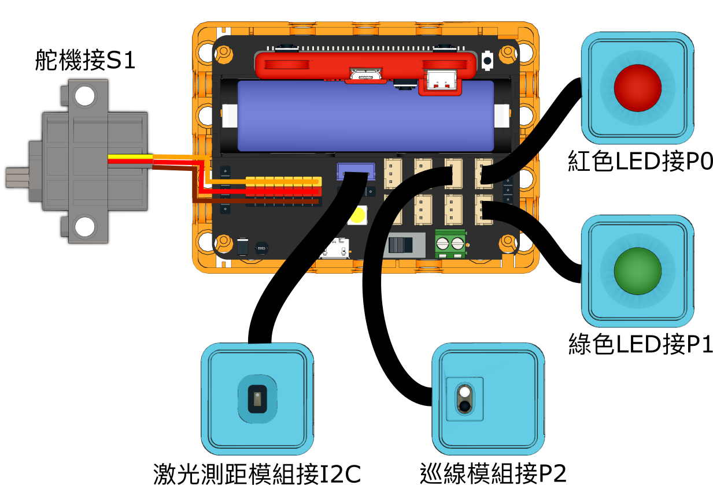

# 智慧停車場

模擬智能停車場，自動打開閘門讓汽車駛進或駛出，自動檢測停車場的空位數量。

## 組裝說明書

[組裝說明書下載(右鍵->另存為)](./pdf/parking.pdf)

## 參考接線

## 參考程式

[參考程式下載(右鍵->另存為)](./sb3/parking.sb3)

## 模型玩法

將小車放到閘門前，閘門就會打開。將小車泊到泊車位，門口的紅色LED會亮起。

當停車位已滿，閘門就不會打開讓其他車駛入。將車子駛離泊車位，閘門就會自動打開並且計算泊車費用。