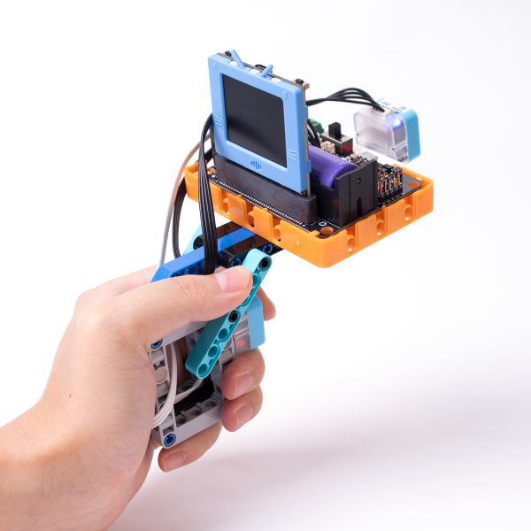
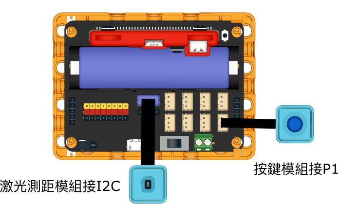
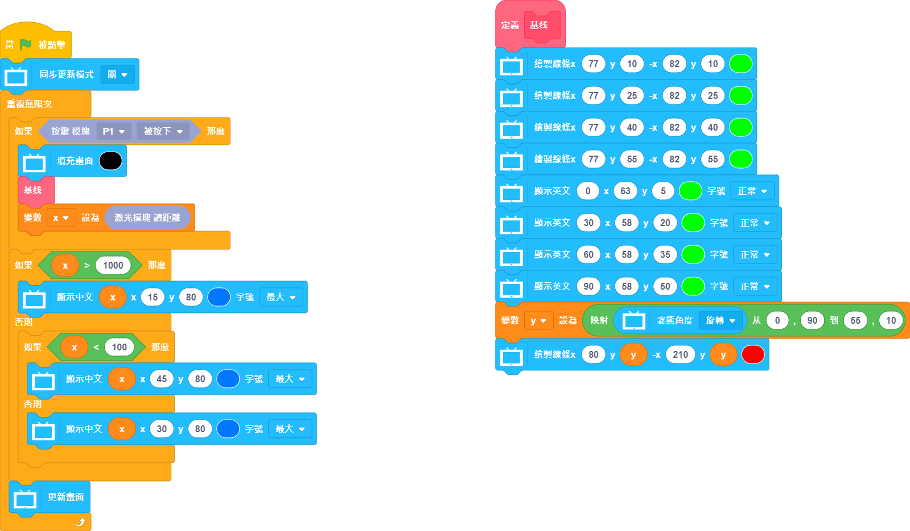

# 激光測距槍

可以用來檢測前方障礙物的距離並實時顯示在屏幕上。

## 組裝說明書

[組裝說明書下載(右鍵->另存為)](https://github.com/kittenbothk/kittenbothk/raw/master/Kits/future_inventor/instructions/pdf/laser_ruler.pdf)

## 參考接線

## 參考程式

### KittenBlock參考程式

[參考程式下載(右鍵->另存為)](https://github.com/kittenbothk/kittenbothk/raw/master/Kits/future_inventor/instructions/sb3/laser.sb3)

### Python 參考程式

    #/bin/python
    
    from future import *
    from sugar import *
    
    y = 0
    y1 = 0
    y2 = 0
    x = 0
    
    
    def valmap(x, in_min, in_max, out_min, out_max):
        return int((x-in_min) * (out_max-out_min) / (in_max-in_min) + out_min)
    
    
    def baseline():
      global y,y1,y2,x
    
      screen.line(77,10,82,10,(0, 255, 0))
      screen.line(77,25,82,25,(0, 255, 0))
      screen.line(77,40,82,40,(0, 255, 0))
      screen.line(77,55,82,55,(0, 255, 0))
      screen.text(str('0'),63,5,1,(0, 255, 0))
      screen.text(str('30'),58,20,1,(0, 255, 0))
      screen.text(str('60'),58,35,1,(0, 255, 0))
      screen.text(str('90'),58,50,1,(0, 255, 0))
      y = (valmap(sensor.pitch(), 0, 90, 55, 10))
      screen.line(80,y,210,y,(255, 0, 0))
    
    
    
    screen.sync = 0
    
    while True:
      if Button("P1").value() == 0:
        screen.fill((0, 0, 0))
        baseline()
        x = TOFDistance().value()
      if x > 1000:
        screen.textCh(x,15,80,3,(0, 119, 255))
      else:
        if x < 100:
          screen.textCh(x,45,80,3,(0, 119, 255))
        else:
          screen.textCh(x,30,80,3,(0, 119, 255))
      screen.refresh()

[參考程式下載(右鍵->另存為)](https://github.com/kittenbothk/kittenbothk/raw/master/Kits/future_inventor/instructions/py/laser.py)

## 模型玩法

按下按鍵，未來板的屏幕就會顯示出測量到的距離。