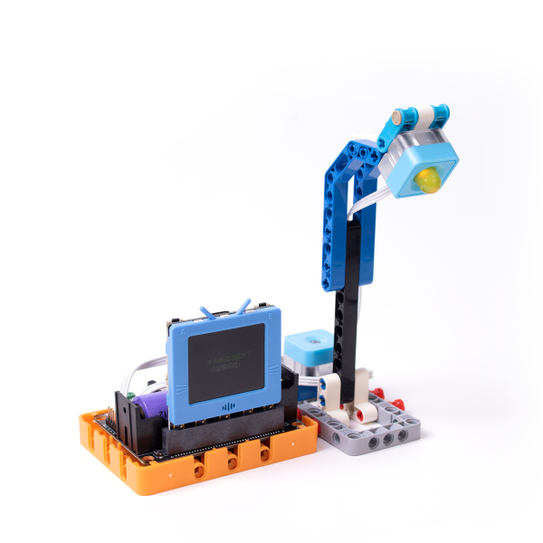
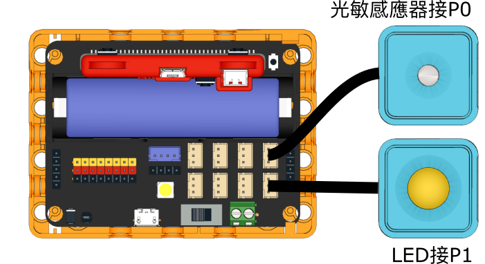
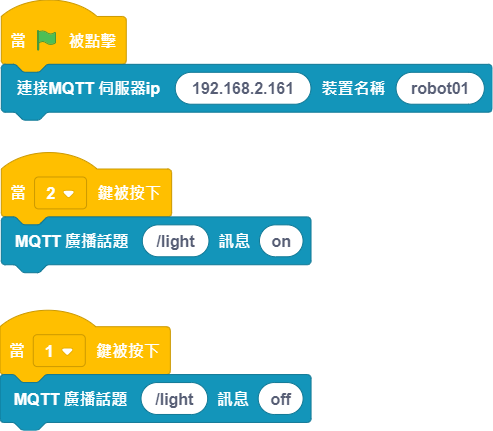

# 智能路燈

模擬一組智能路燈，透過物聯網控制路燈的開關，亮度會因應環境亮度自動調節。

## 組裝說明書

[組裝說明書下載(右鍵->另存為)](https://github.com/kittenbothk/kittenbothk/raw/master/Kits/future_inventor/instructions/pdf/streetlamp.pdf)

## 參考接線

## MakerCloud 參考程式

## KittenBloock 參考程式

### 未來板控制端

    請在Kittenblock開啟本地IoT伺服器，並自行將伺服器的ip填入程式。

[參考程式下載(右鍵->另存為)](https://github.com/kittenbothk/kittenbothk/raw/master/Kits/future_inventor/instructions/sb3/streetlamp.sb3)

### Kittenblock控制端

    請在Kittenblock開啟本地IoT伺服器，並自行將伺服器的ip填入程式。

[參考程式下載(右鍵->另存為)](https://github.com/kittenbothk/kittenbothk/raw/master/Kits/future_inventor/instructions/sb3/streetlamp_iot.sb3)

## 模型玩法

使用Kittenblock控制端程式控制路燈的開或關，按1關閉，按2開啟。開啟後路燈的亮度會因環境亮度作自我調節。