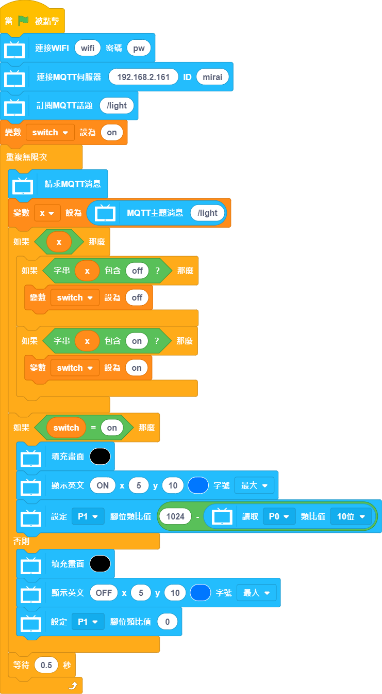

# 智能路燈

模擬一組智能路燈，透過物聯網控制路燈的開關，亮度會因應環境亮度自動調節。

## 組裝說明書

[組裝說明書下載(右鍵->另存為)](https://github.com/kittenbothk/kittenbothk/raw/master/Kits/future_inventor/instructions/pdf/streetlamp.pdf)

## 參考接線

## MakerCloud 參考程式

### 未來板控制端

### KittenBlock參考程式

    請在Kittenblock開啟本地IoT伺服器，並自行將伺服器的ip填入程式。

[參考程式下載(右鍵->另存為)](https://github.com/kittenbothk/kittenbothk/raw/master/Kits/future_inventor/instructions/sb3/streetlamp.sb3)

### Python參考程式

    #/bin/python
    
    from time import sleep
    from future import *
    from sugar import *
    import mqttsimple
    P0 = MeowPin('P0', 'ANALOG')
    P1 = MeowPin('P1', 'PWM')
    
    
    x = 0
    switch = 0
    
    
    
    wifi.connect(str(""), "")
    
    mqtt = mqttsimple.MQTTClient("192.168.2.161", "mirai",port=1883)
    mqtt.connect()
    
    mqtt.subscribe("/light")
    
    switch = "on"
    
    while True:
      mqtt.check_msg()
      x = mqtt.mqttRead("/light")
      if bool(x):
        if "off" in x:
          switch = "off"
        if "on" in x:
          switch = "on"
      if switch == "on":
        screen.fill((0, 0, 0))
        screen.text(str("ON"),5,10,3,(0, 119, 255))
        P1.setAnalog(1024 - P0.getAnalog(10))
      else:
        screen.fill((0, 0, 0))
        screen.text(str("OFF"),5,10,3,(0, 119, 255))
        P1.setAnalog(0)
      sleep(0.5)

[參考程式下載(右鍵->另存為)](https://github.com/kittenbothk/kittenbothk/raw/master/Kits/future_inventor/instructions/py/streetlamp.py)

### Kittenblock控制端

    請在Kittenblock開啟本地IoT伺服器，並自行將伺服器的ip填入程式。

[參考程式下載(右鍵->另存為)](https://github.com/kittenbothk/kittenbothk/raw/master/Kits/future_inventor/instructions/sb3/streetlamp_iot.sb3)

## 模型玩法

使用Kittenblock控制端程式控制路燈的開或關，按1關閉，按2開啟。開啟後路燈的亮度會因環境亮度作自我調節。