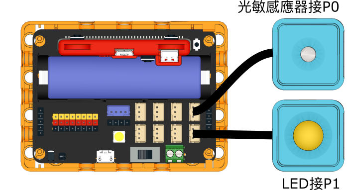
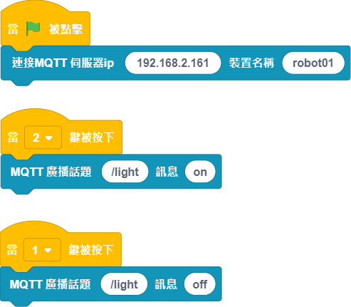

# 智能交通燈

模擬一組智能交通燈。

## 組裝說明書

[組裝說明書下載](www.google.com)

## 參考接線

## 參考程式

### Kittenblock控制端

    請在Kittenblock開啟本地IoT伺服器，並自行將伺服器的ip填入程式。

### Kittenblock控制端

    請在Kittenblock開啟本地IoT伺服器，並自行將伺服器的ip填入程式。

[參考程式下載](www.google.com)

## 模型玩法

使用Kittenblock控制端程式控制路燈的開或關，按1關閉，按2開啟。開啟後路燈的亮度會因環境亮度作自我調節。