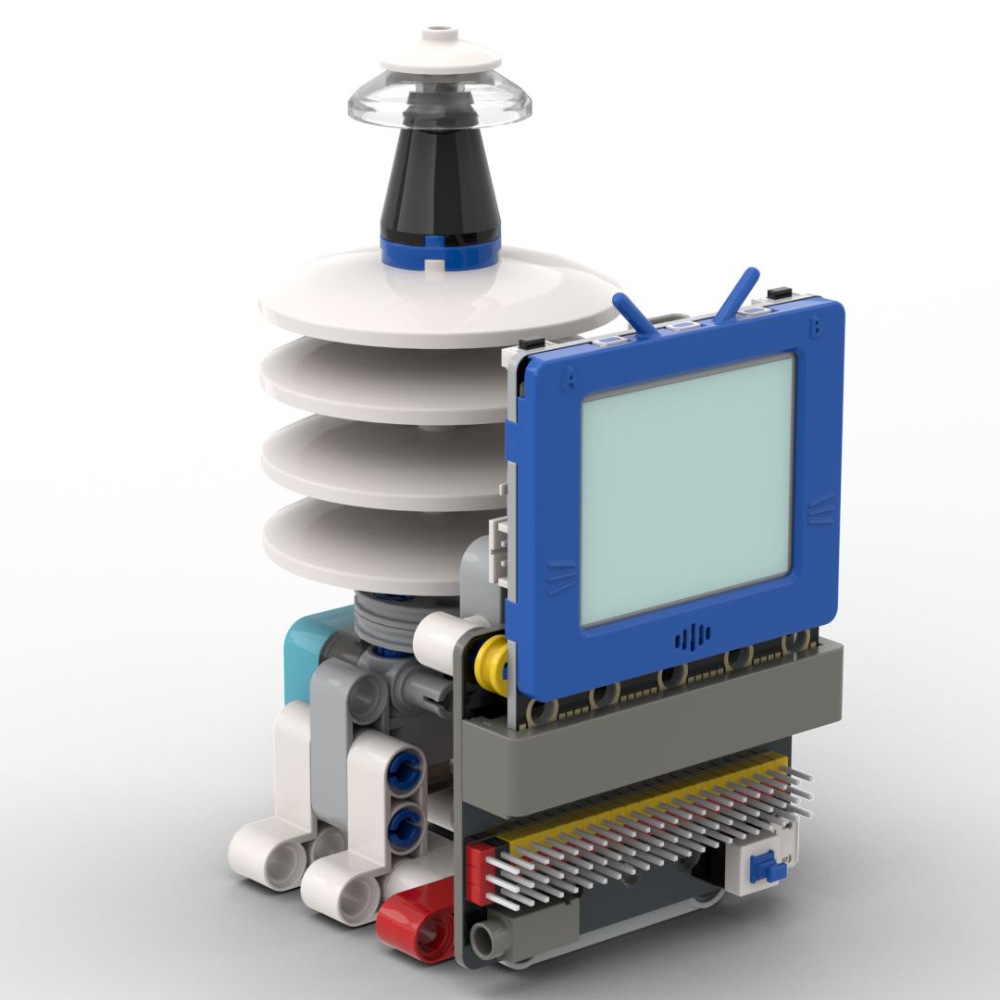
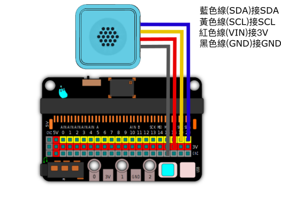
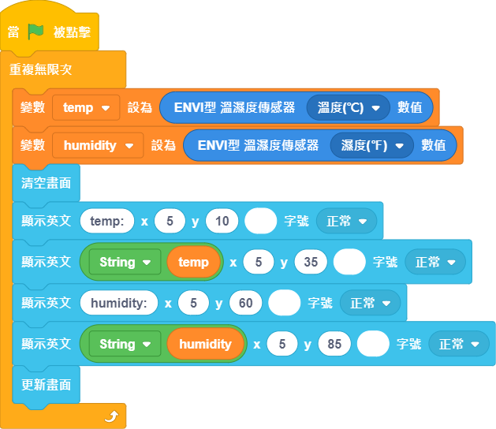

# 溫度氣壓站

一個可以檢測環境溫度和氣壓的的氣象站應用。

## 搭建說明書

[下載搭建說明書](https://github.com/kittenbothk/kittenbothk/raw/master/Kits/future_weather/instructions/temp_atmosphere.pdf)

## 接線圖

## 範例程式

[下載範例程式](https://github.com/kittenbothk/kittenbothk/raw/master/Kits/future_weather/sb3/1_temp_hpa.sb3)
