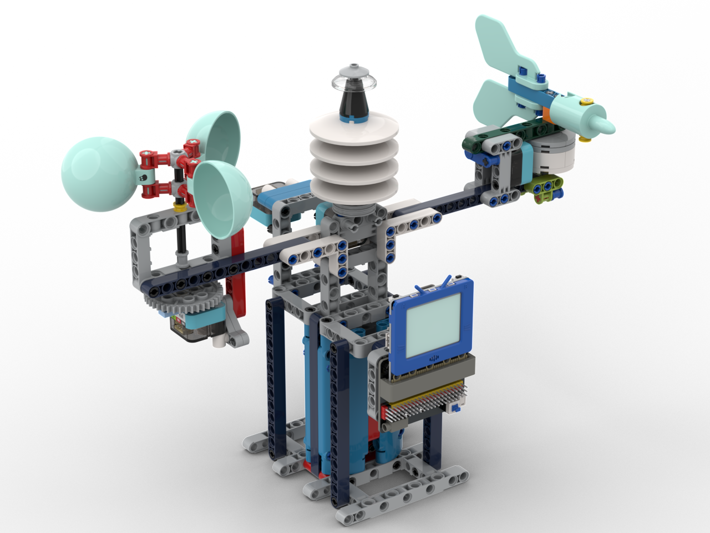
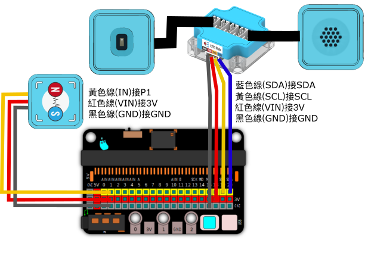

# 完整氣象站

一個可以集合所有功能的模型。

    這模型需要2塊未來板。

## 搭建說明書

[下載搭建說明書](https://github.com/kittenbothk/kittenbothk/raw/master/Kits/future_weather/instructions/complete_station.pdf)

## 接線圖

## 範例程式

### 主未來板程式(風速+雨量+溫度)

[下載範例程式](https://github.com/kittenbothk/kittenbothk/raw/master/Kits/future_weather/sb3/7_complete.sb3)

[下載範例python程式](https://github.com/kittenbothk/kittenbothk/raw/master/Kits/future_weather/py/7_complete.py)

### 副未來板程式(風向)

[下載範例程式](https://github.com/kittenbothk/kittenbothk/raw/master/Kits/future_weather/sb3/7_complete_direction.sb3)

[下載範例python程式](https://github.com/kittenbothk/kittenbothk/raw/master/Kits/future_weather/py/7_complete_direction.py)