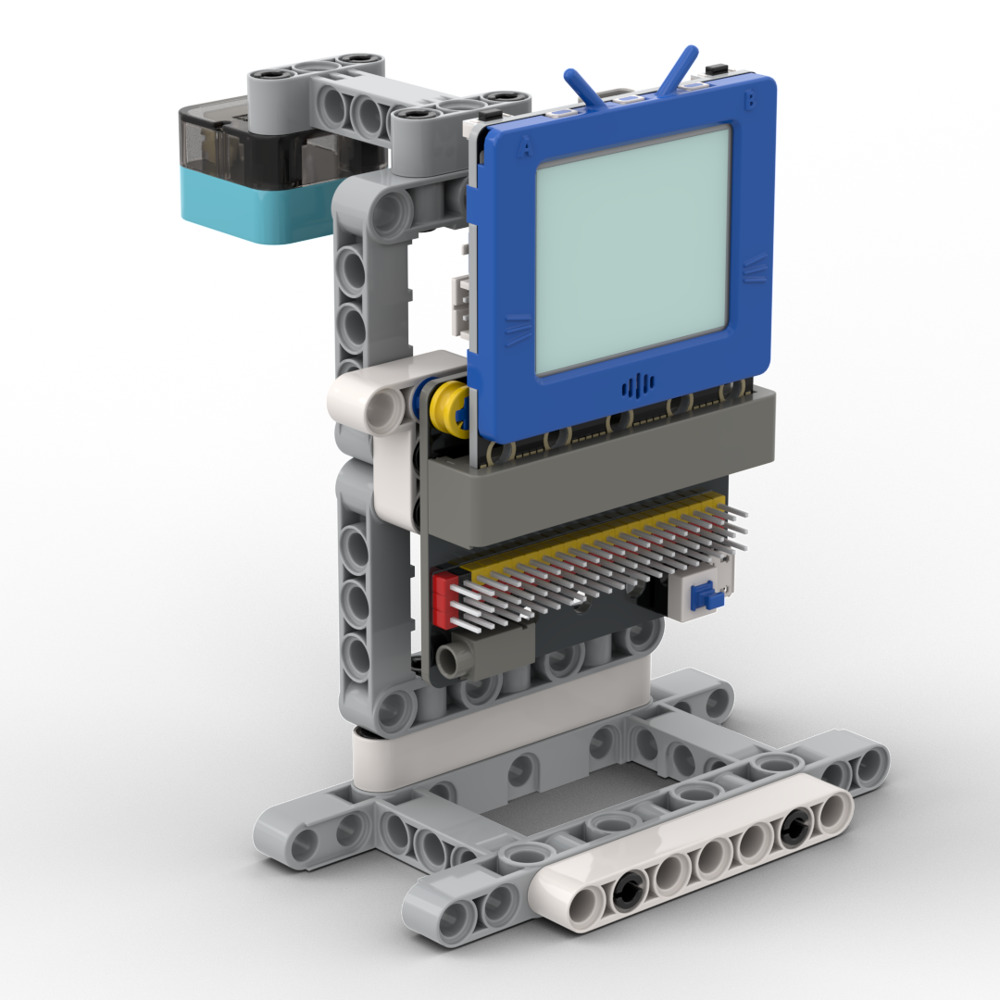

# 雨量檢測

一個可以檢測雨量的模型。

## 搭建說明書

[下載搭建說明書](https://github.com/kittenbothk/kittenbothk/raw/345ada4b3e77923d165c0592a65a5ad5345995c9/Kits/future_weather/instructions/rainfall.pdf)

## 接線圖

## 範例程式

[下載範例程式](https://github.com/kittenbothk/kittenbothk/raw/345ada4b3e77923d165c0592a65a5ad5345995c9/Kits/future_weather/sb3/2_rainfall.sb3)