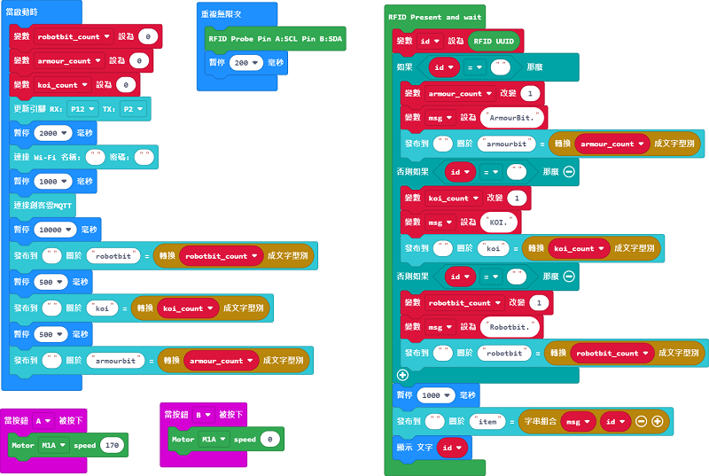

# 倉庫貨物管理系統參考程式

## MakerCloud版參考程式

[參考程式](https://makecode.microbit.org/_Ef8DP8gCThfX)

### 模型玩法

1. 在程式填入Wifi的登入資料和MakerCloud的主題資料
2. 在程式裡填入與貨品相應的RFID編號
3. 開啟電源後等待WifiBrick連接到MakerCloud
4. 按A鍵啟動輸送帶，B鍵停止輸送帶
5. 當RFID魔塊感應到貨物的RFID晶片後，Micro:bit會顯示RFID資訊，並且會將貨物資料上傳到MakerCloud平台

### MakerCloud平台設定教學

在MakeCloud平台建立新主題，建立數據類型item、koi、robotbit、armourbit。(貨品參考)

為每個數據類型建立圖表。

建立儀表板，顯示建立的圖表。

