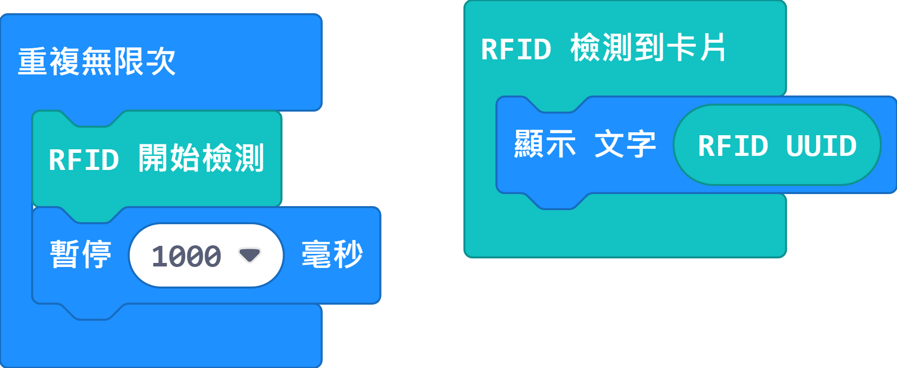

# 倉庫貨物管理系統Micro:bit參考程式

## RFID參考程式

使用這程式查看RFID晶片ID。

[Sample Program](https://makecode.microbit.org/_7mTPaUfz5FLd)

## MakerCloud版參考程式

[參考程式](https://makecode.microbit.org/_Ef8DP8gCThfX)

### 模型玩法

1. 在程式填入Wifi的登入資料和MakerCloud的主題資料
2. 在程式裡填入與貨品相應的RFID編號
3. 開啟電源後等待WifiBrick連接到MakerCloud
4. 按A鍵啟動輸送帶，B鍵停止輸送帶
5. 當RFID魔塊感應到貨物的RFID晶片後，Micro:bit會顯示RFID資訊，並且會將貨物資料上傳到MakerCloud平台

## ObjectBlocks版參考程式

[參考程式](https://makecode.microbit.org/_9UHYyzdWJM0E)

### 模型玩法

1. 在程式填入Wifi的登入資料和ObjectBlocks的主題資料
2. 在程式裡填入與貨品相應的RFID編號
3. 開啟電源後等待WifiBrick連接到ObjectBlocks
4. 按A鍵啟動輸送帶，B鍵停止輸送帶
5. 當RFID魔塊感應到貨物的RFID晶片後，Micro:bit會顯示RFID資訊，並且會將貨物資料上傳到ObjectBlocks平台

## ThingSpeak版參考程式

[參考程式](https://makecode.microbit.org/_RU8DYRgbm1os)

### 模型玩法

1. 在程式填入Wifi的登入資料和ThingSpeak的主題資料
2. 在程式裡填入與貨品相應的RFID編號
3. 開啟電源後等待WifiBrick連接到ThingSpeak
4. 按A鍵啟動輸送帶，B鍵停止輸送帶
5. 當RFID魔塊感應到貨物的RFID晶片後，Micro:bit會顯示RFID資訊，並且會將貨物資料上傳到ThingSpeak平台
    
   
    注意：由於ThingSpeak只支援數字，所以ThingSpeak不支援顯示貨品名稱和ID