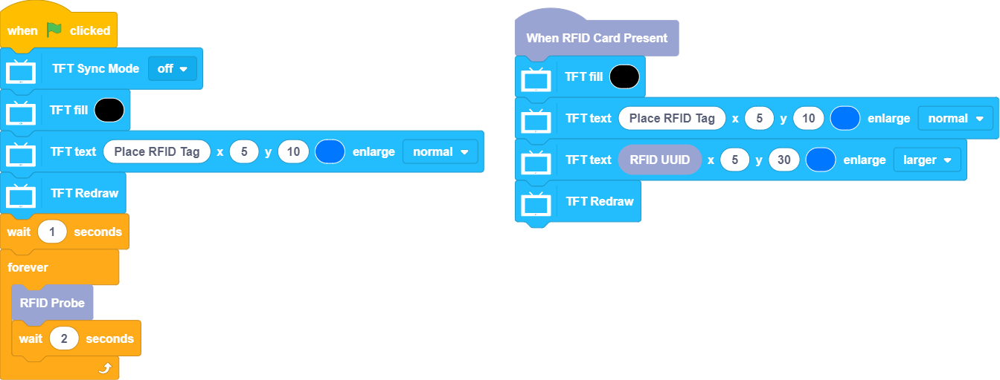
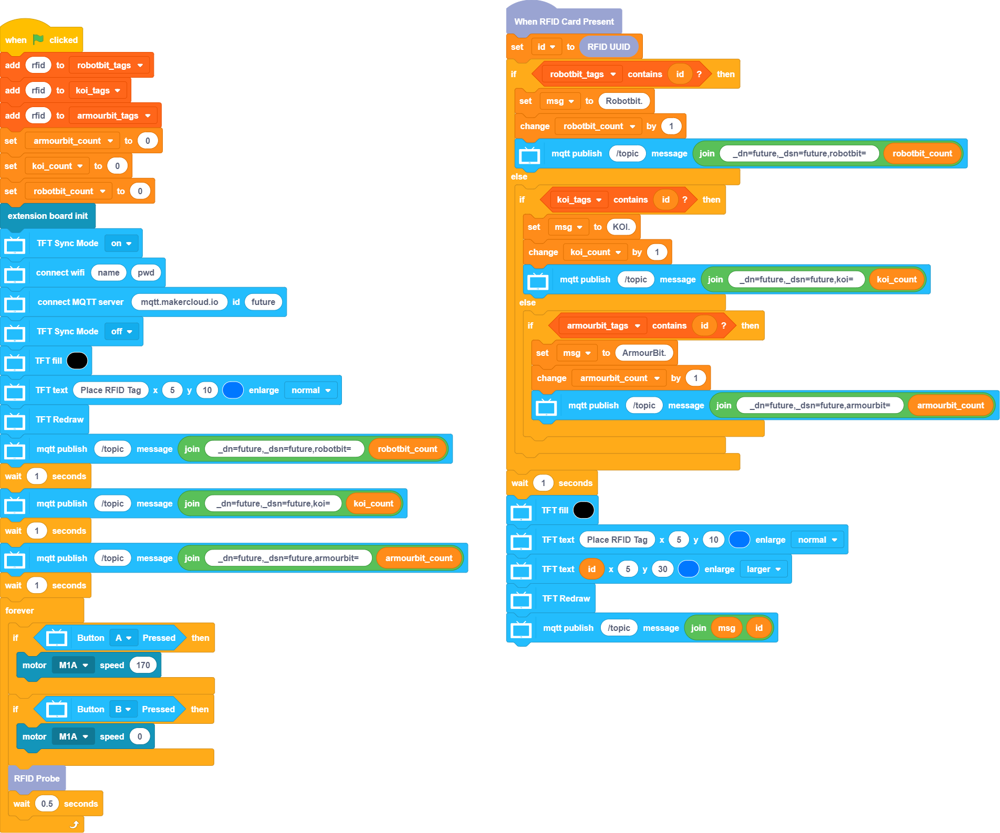
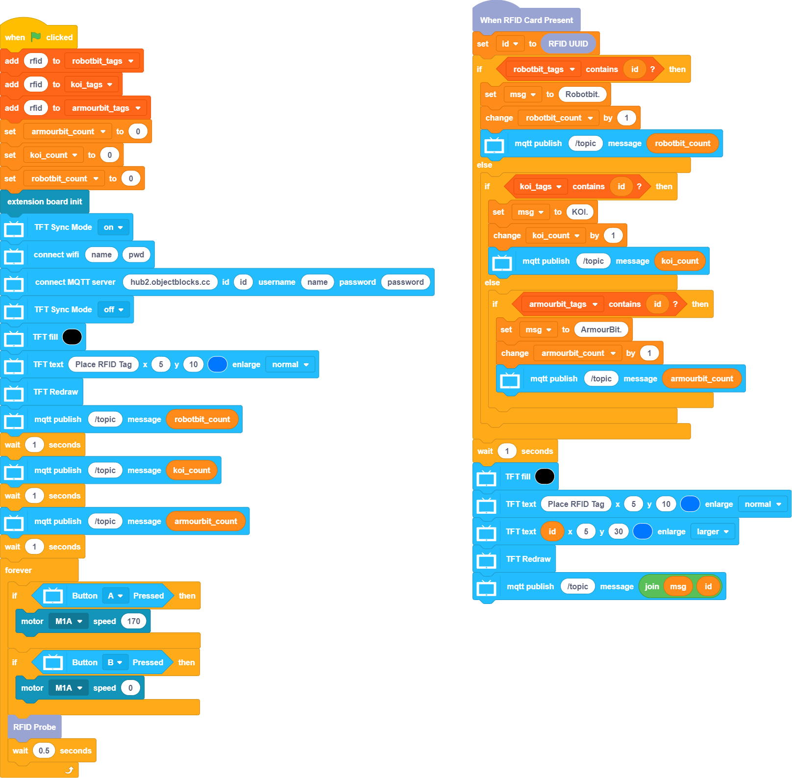

# 倉庫貨物管理系統未來板參考程式

## RFID參考程式

使用這程式查看RFID晶片ID。

[參考程式](https://github.com/kittenbothk/kittenbothk/blob/master/Kits/inventory_system/images/rfid_futureboard.sb3)

## MakerCloud版參考程式

[參考程式](https://github.com/kittenbothk/kittenbothk/blob/master/Kits/inventory_system/images/code_makercloud_futureboard.sb3)

### 模型玩法

1. 在程式填入Wifi的登入資料和MakerCloud的主題資料
2. 在程式裡填入與貨品相應的RFID編號
3. 開啟電源後等待未來板連接到MakerCloud
4. 按A鍵啟動輸送帶，B鍵停止輸送帶
5. 當RFID魔塊感應到貨物的RFID晶片後，未來板會顯示RFID資訊，並且會將貨物資料上傳到MakerCloud平台

## ObjectBlocks版參考程式

[參考程式](https://github.com/kittenbothk/kittenbothk/blob/master/Kits/inventory_system/images/code_objectblocks_futureboard.sb3)

### 模型玩法

1. 在程式填入Wifi的登入資料和ObjectBlocks的主題資料
2. 在程式裡填入與貨品相應的RFID編號
3. 開啟電源後等待未來板連接到ObjectBlocks
4. 按A鍵啟動輸送帶，B鍵停止輸送帶
5. 當RFID魔塊感應到貨物的RFID晶片後，未來板會顯示RFID資訊，並且會將貨物資料上傳到ObjectBlocks平台

## ThingSpeak版參考程式

[參考程式](https://github.com/kittenbothk/kittenbothk/blob/master/Kits/inventory_system/images/code_thingspeak_futureboard.sb3)

### 模型玩法

1. 在程式填入Wifi的登入資料和ThingSpeak的主題資料
2. 在程式裡填入與貨品相應的RFID編號
3. 開啟電源後等待未來板連接到ThingSpeak
4. 按A鍵啟動輸送帶，B鍵停止輸送帶
5. 當RFID魔塊感應到貨物的RFID晶片後，未來板會顯示RFID資訊，並且會將貨物資料上傳到ThingSpeak平台
    
   
    注意：由於ThingSpeak只支援數字，所以ThingSpeak不支援顯示貨品名稱和ID