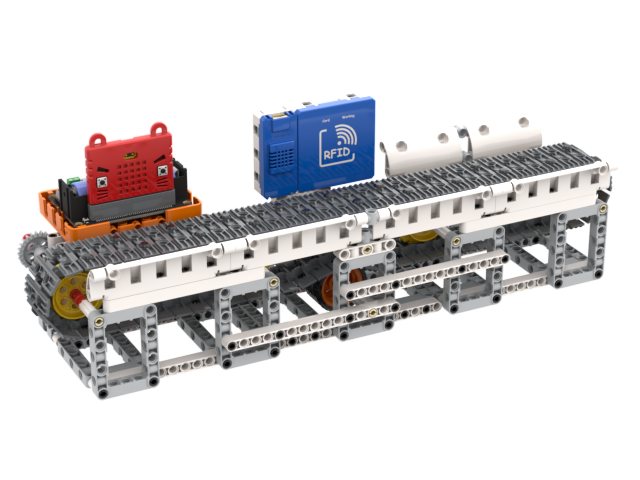

# 倉庫貨物管理系統

倉庫貨物管理系統模擬了倉庫內貨物進出的情景，透過感應貨物的RFID晶片，系統可以將進出的貨物資料上傳到物聯網平台作管理。

## 產品特色

- 基於Microbit的圖形化編程，更容易上手
- 兼容樂高積木，擴展性高
- 支援MakeCode和Kittenblock編程3

## 套件內容

- Robotbit Edu擴展板 x1
- 塑膠積木包 x1
- GeekServo 2KG電機 x1
- WifiBrick x1
- Powerbrick RFID魔塊 x1
- 18650鋰電池 x1
- RFID晶片