# 平台設定教學

## MakerCloud平台設定教學

在MakeCloud平台建立新主題，建立數據類型item、koi、robotbit、armourbit。(貨品參考)

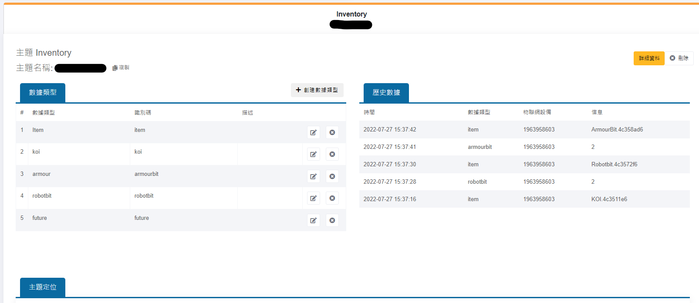

為每個數據類型建立圖表。

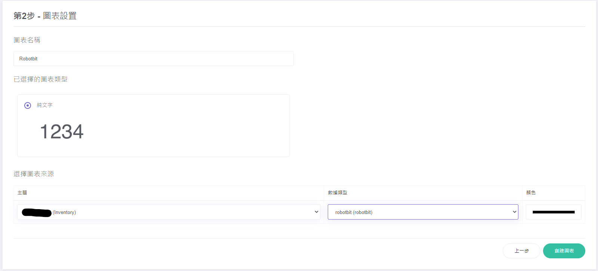

建立儀表板，顯示建立的圖表。

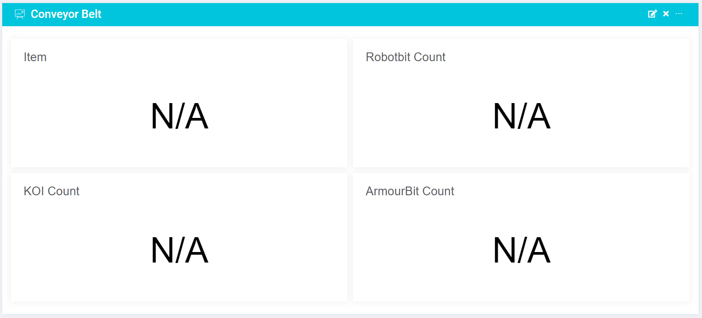

## ObjectBlocks平台設定教學

建立新專案。

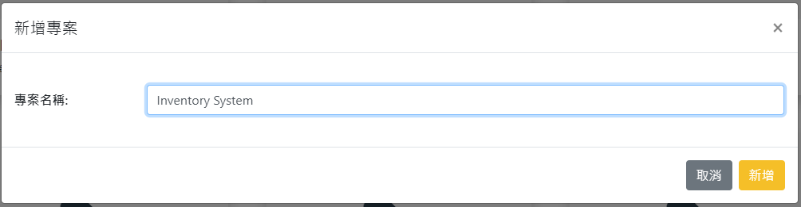

建立渠道Robotbit、Armourbit、KOI、Item。(必須剔選網絡勾手選項)

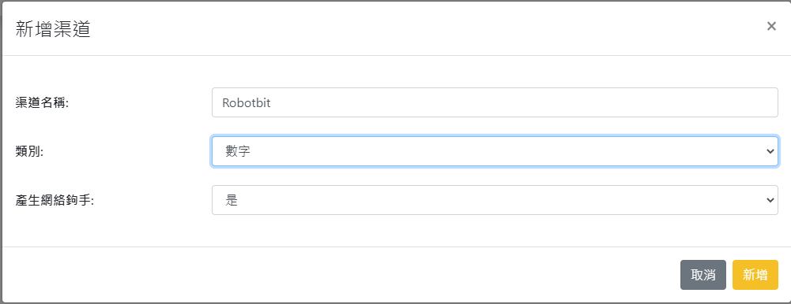

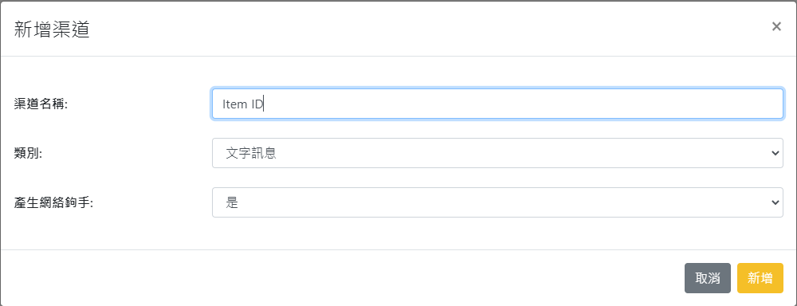

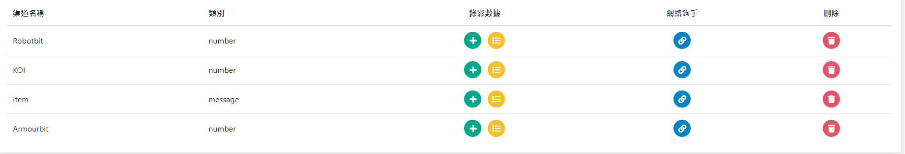

新增儀表板。

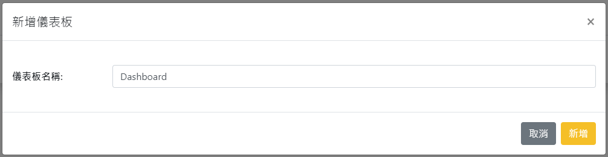

新增工具顯示渠道信息。

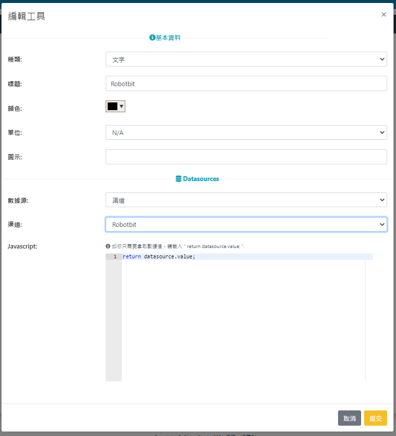

## ThingSpeak平台設定教學

建立ThingSpeak頻道，設定數據欄Robotbit，KOI，Armourbit，Item。

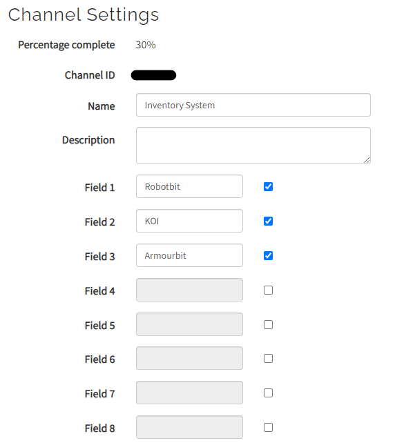

將頻道設為公開。

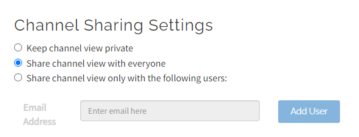

設定新MQTT Device。

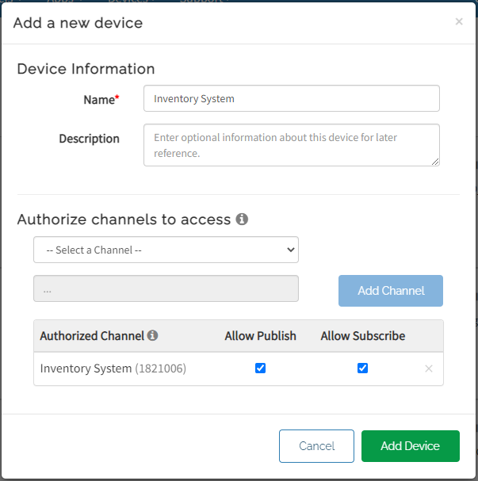

請好好保管ThingSpeak存取登入密碼。

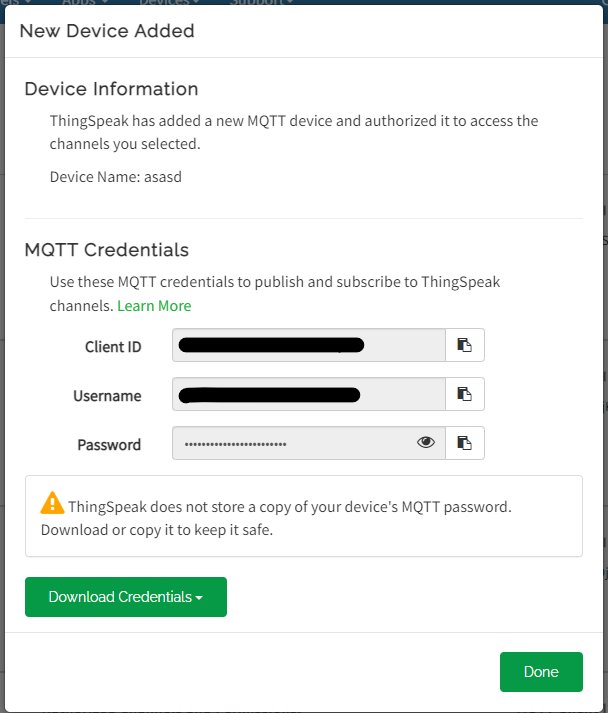