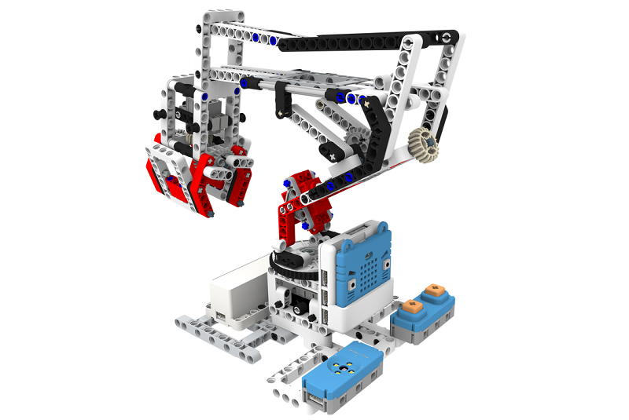
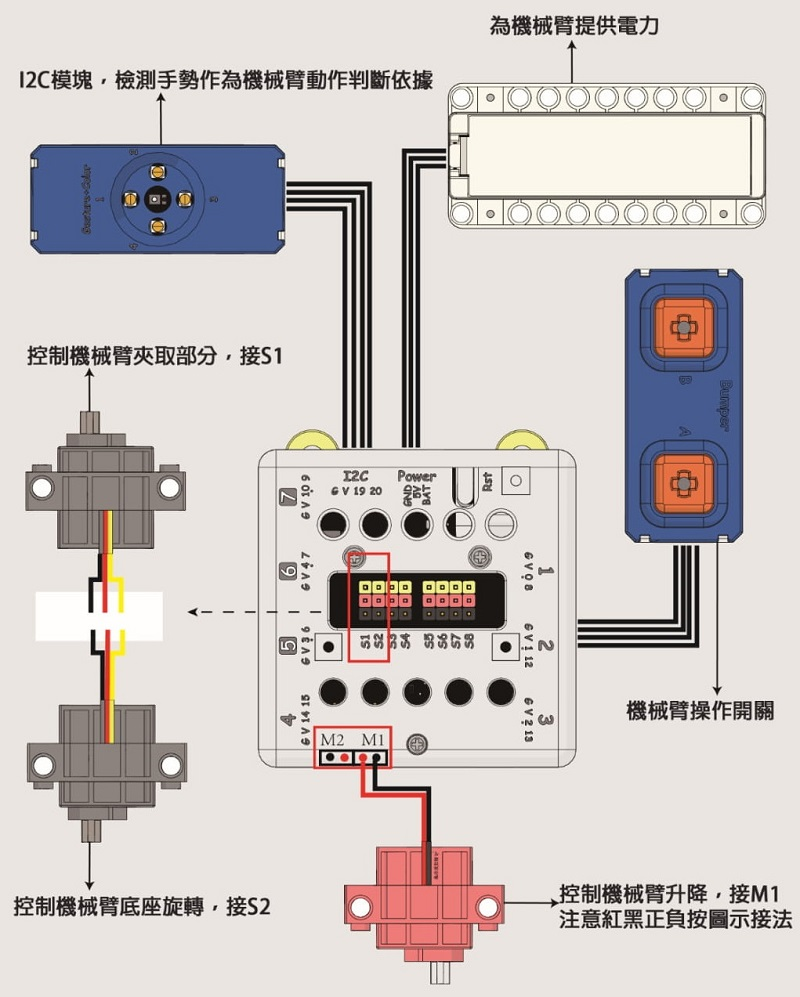
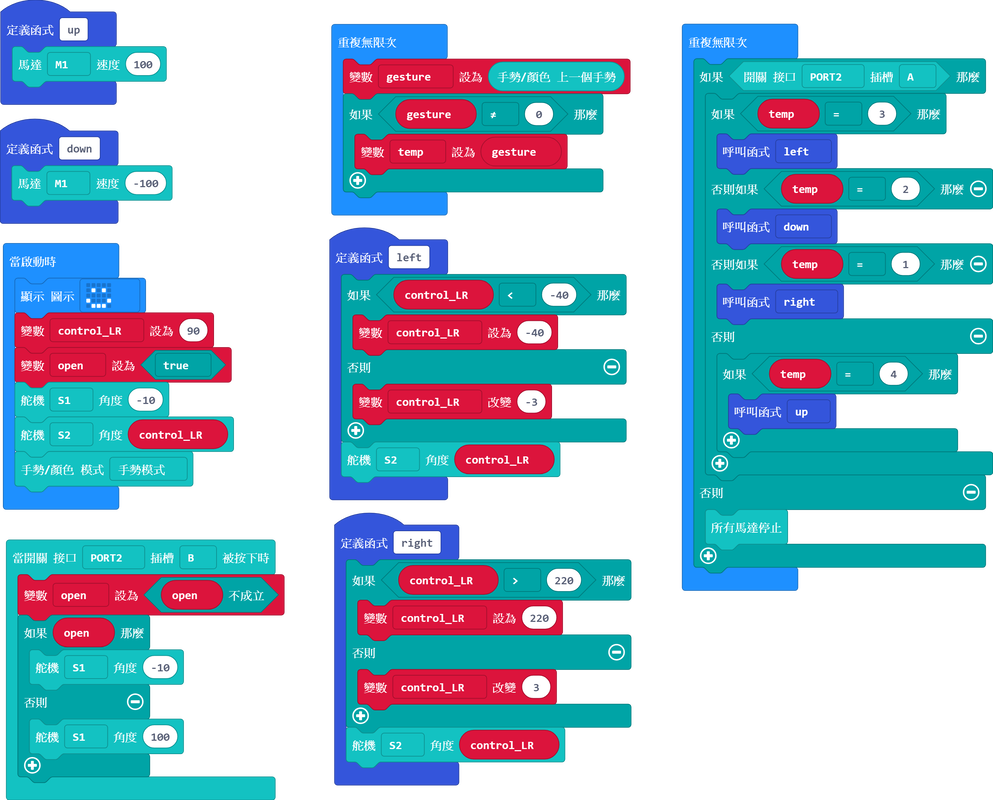

# 手勢控制機械臂說明書

## 教材資源包下載

包括說明書和音效檔案： [資源包下載地址](https://bit.ly/Powerbrick10in1BuildingGuide)

## 參考接線

## 參考程式

[參考程式資源包下載地址](https://bit.ly/Powerbrick10in1ModelsHex)

## 模型玩法

這是一隻小吊臂模型，您可以用它來抓起小物件。

開動模型後，可以用手指選擇吊臂方向。

將手指向上或下移動然後按下A按鍵，可以分別控制吊臂的上下伸展。

將手指向左或右移動然後按下A按鍵，可以分別控制吊臂的左右旋轉。

按下B按鍵，控制夾爪的開合。
