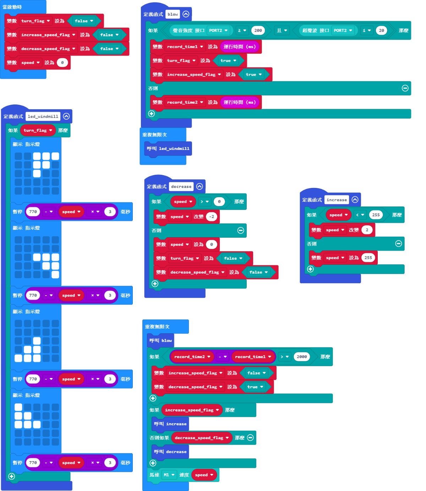

# 風車說明書

## 教材資源包下載

包括說明書和音效檔案： [資源包下載地址](https://bit.ly/Powerbrick10in1BuildingGuide)

## 參考接線

## 參考程式

[參考程式資源包下載地址](https://bit.ly/Powerbrick10in1ModelsHex)

## 模型玩法

這是一台風車模型。

開動模型後，風車扇葉不會自動轉動。

想令風車扇葉轉動，你就要向超聲波感應器吹氣，模擬吹風。

風車扇葉就會徐徐轉動，假如你不再向它吹氣，風車會停下來。
