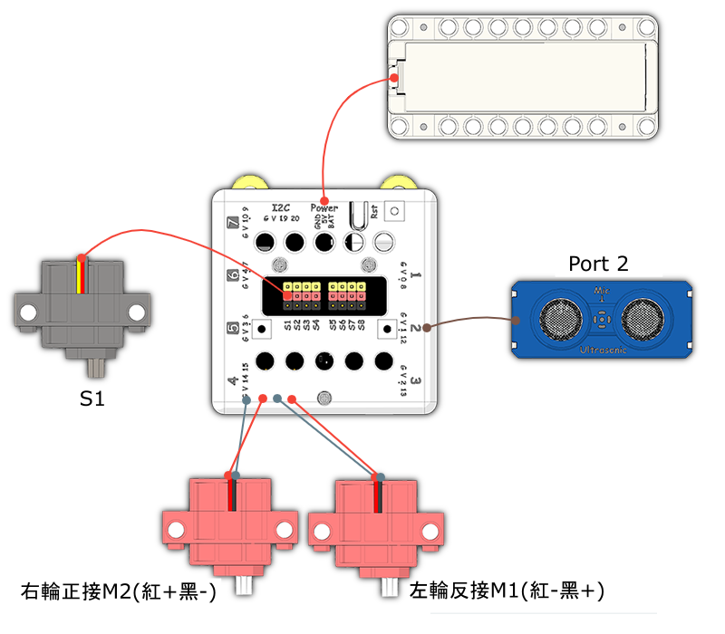

# 智能垃圾箱說明書

## 教材資源包下載

包括說明書和音效檔案： [資源包下載地址](https://bit.ly/Powerbrick10in1BuildingGuide)

## 參考接線

## 參考程式

[參考程式資源包下載地址](https://bit.ly/Powerbrick10in1ModelsHex)

## 模型玩法

這是一個智能垃圾桶。

將垃圾桶放在桌上然後開動模型，再同時按下A和B按鍵就可以開始控制它。

將手掌放到超聲波感應器前可以控制它的移動。

- 將手掌放在垃圾桶前0-10cm距離內，可以將垃圾桶推開。

- 將手掌放在垃圾桶前20-30cm距離內，可以將垃圾桶拉近。

- 將手掌放在垃圾桶前10-20cm距離內，垃圾桶的蓋會打開，過一段時間會自動閉上。

你亦可以手動控制開關垃圾桶蓋，按下A和B就可以分別開啟和關閉頂蓋。
