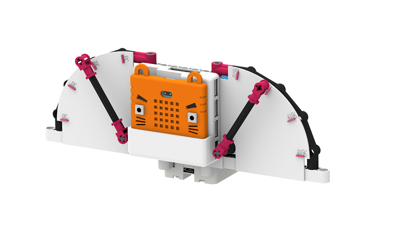
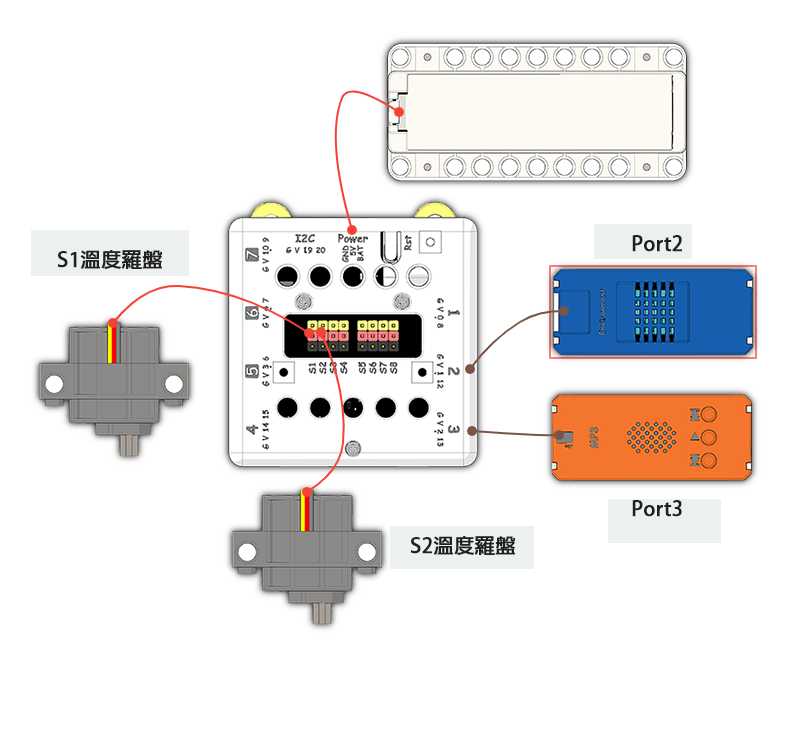
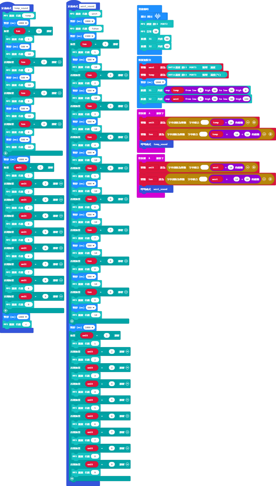

# 氣候滙報機說明書

## 教材資源包下載

包括說明書和音效檔案： [資源包下載地址](https://bit.ly/Powerbrick10in1BuildingGuide)

## 參考接線

## 參考程式

[參考程式資源包下載地址](https://bit.ly/Powerbrick10in1ModelsHex)

請將MP3檔案儲存到microSD卡，並將卡插入MP3模組。

## 模型玩法

這是一部氣候匯報機，它可以報告當時環境的溫度和濕度。

開動模型後，按下A按鍵，模型會說出當時的溫度；按下B按鍵，模型會說出當時的濕度。
