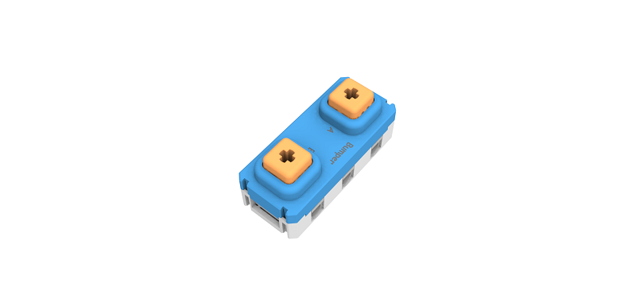
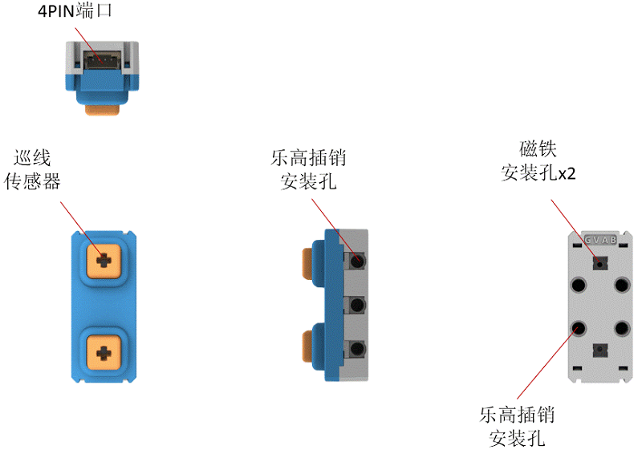
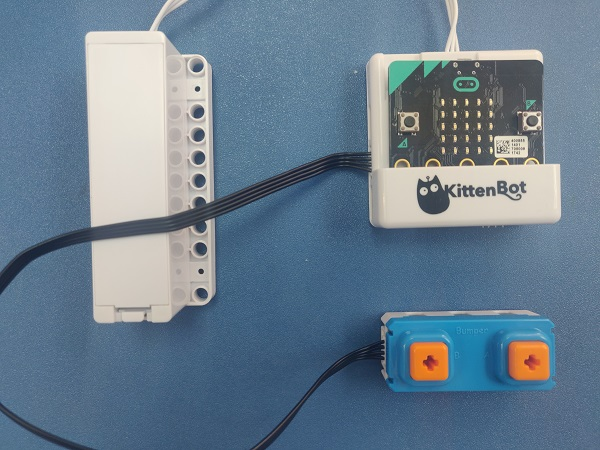
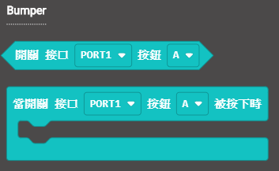
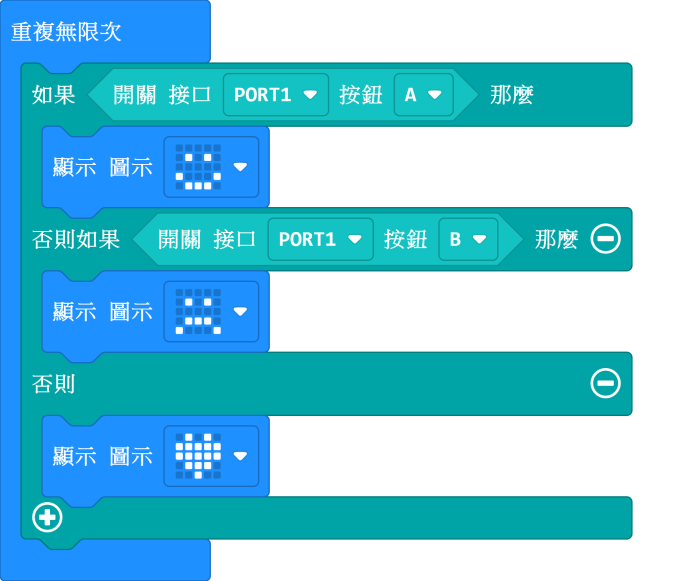

# 雙按鍵感應器

這是一塊按鍵模組，可以檢測按鍵是否按下。當按鍵被按下，模組背後應對的LED會亮燈。另外按键键按鍵上亦可插上樂高十字軸。

## 詳細介紹

## 產品參數

- 支援電壓：3V-5V
- 尺寸：56mm X 24mm X 25mm
- 接口：4pin防反插接口
- 類型：數字傳感器，按下按鍵，觸發事件

## 接線方法

將按鍵模組用4pin排線連接至Armourbit。

## MakeCode編程教學

加載PowerBrick插件：https://github.com/KittenBot/pxt-powerbrick

### 巡線模組積木塊:

### 按鍵檢測

[參考程式下載](www.google.com)

## 模組演示

