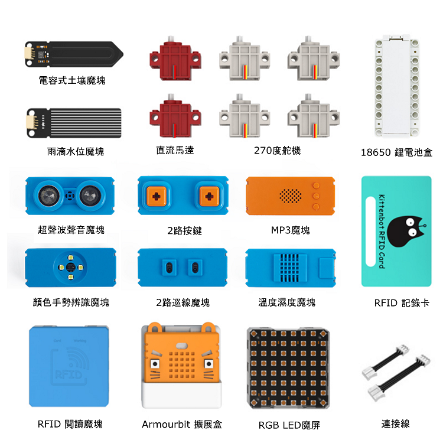
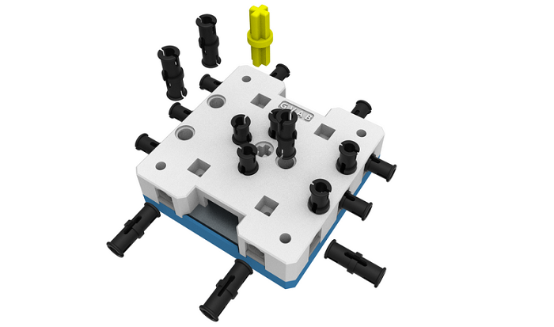
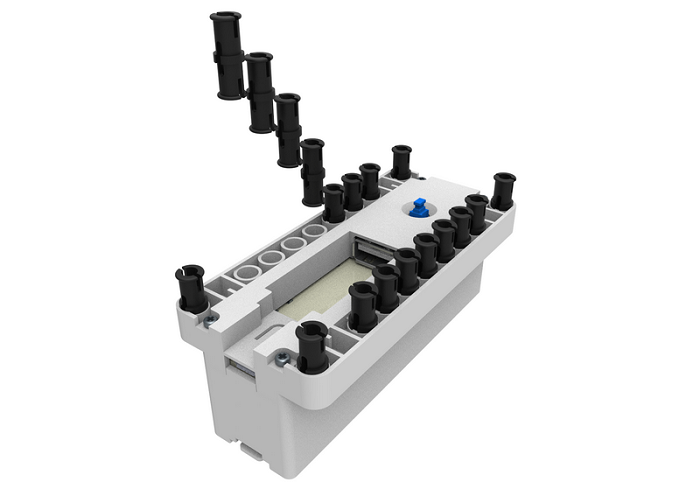
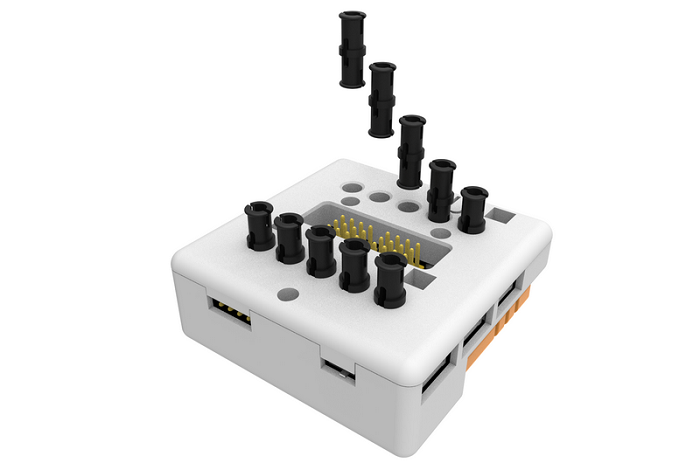

# PowerBrick產品介紹

PowerBrick純電子版 (HKBK8038A)

PowerBrick連積木版 (HKBK8039B)

PowerBrick All-In-One是由kittenbot設計的十合一套件，它是為BBC microbit度身訂造，
套件包含多款感應器，令中小學生簡易地學習編程與能夠啟發他們的創客精神。

## 產品背景

在香港，大多學校都使用BBC Microbit進行STEM教學。Microbit小巧玲瓏，又集成多種功能，實在對中小學生學習編程上比較方便。

不過Microbit存在接線的困難，Microbit的接線電路比較小，需要使用鱷魚夾或者杜邦線連接，對老師來說也有難度，更何況是中小學生呢。
而且Microbit的電路板外露亦會導致問題，輕則導致電線短路，損壞零件；重則令學生觸電受傷。
與其要中小學生與接線糾纏，我們希望中小學生可以花更多精力在邏輯訓練上。

有見及此，kittenbot針對microbit推出了PowerBrick，將Microbit的接線變得非常輕鬆，並包含了10款不同的感應器，配以官方的makecode插件，以往令大家苦惱的接線和編程都變得輕而易舉了。

這套產品可以讓學生們輕鬆快速地將他們的創意以實物的方式呈現出來，不但訓練他們的邏輯思考能力，更激發他們的創客思維。

## PowerBrick 特色

1. PowerBrick包含的Armourbit擴展板以Microbit為主控，支援Makecode編程。
2. Armourbit擴展板上自帶蜂鳴器，舵機電機驅動，能夠簡易製作相對複雜的機器。
3. PowerBrick完全捨棄了需逐條接駁的鱷魚夾和杜邦線，採用了自家設計的排線和防反插接頭，確保接線的穩定和安全，學生容易理解，更減輕教師教學的壓力。
4. 套件的零件魔塊都有堅硬的塑膠外殼，不但令零件魔塊變得更加安全，亦令零件魔塊變得美觀。
5. 所有魔塊外殼都預先搭載多個樂高標準孔位，完美通用樂高機械件，學生不需要用螺絲裝嵌。令創作變得魔塊化，可以輕易與樂高機械件配合，創作不同的機械和作品。
6. 支援kittenbot旗下的其他魔塊，例如：AI鏡頭KOI，WiFiBrick等。

## Powerbrick套件內容

PowerBrick有兩種版本，分別為PowerBrick純電子版和PowerBrick連積木版，兩者都包含Armourbit與十種感應器魔塊和電機。
兩者的分別在於連積木版本會包括一包樂高機械件，讓你可以立即運用積木進行創作。

### 套件內容:
1. Armourbit擴展板x1
1. Armourbit電池盒x1
1. 感應器魔塊套裝x1
1. 一組防反插連接線x1
1. 270度舵機x4
1. 電機x2
1. 18650鋰電池x1
2. 積木包x1 (只限HKBK8039B)

### 魔塊介紹:

1. 溫度濕度魔塊
1. 土壤濕度魔塊
1. 雨滴水位魔塊
1. 超聲波魔塊
1. 雙路IR巡線魔塊
1. AB按鍵魔塊
1. 顏色手勢魔塊
1. RFID魔塊連RFID卡片
1. 全彩點陣魔塊
2. MP3魔塊

## 與樂高裝插方法

### 3x7魔塊（以樂高標準孔位作單位）

### 7x7魔塊

### 電池盒

### Armourbit擴展板

### 大小尺寸孔位位置尺寸

完美兼容樂高，符合樂高尺寸標準，輕鬆使用自己的樂高零件進行創作。

## 電線連接方法

使用4pin防反插排線，不用再擔心接線錯誤、接觸不良、電路損壞之類問題。讓課堂上接線十分輕鬆，提升教師教學效率。

### 4pin柔軟防反插排線

## 支援Makecode編程

支援最普及的編程平台makecode，配搭自家插件，功能強大易用，令學生容易上手。

## Kittenblock編程平台：

Kittenbot亦開發了編程平台Kittenblock，以Scratch作基礎，加入了自家插件，實現舞台與PowerBrick的互動。

## FAQ

**1.PowerBrick的魔塊就只有這10種嗎？**

答：不是的，這只是為大家提供最基礎最常用的魔塊，需要的話可以加購其他魔塊。

**2.PowerBrick是不是只能對應套件裏的魔塊使用呢？**

答：不是的，Kittenbot的產品都應對PowerBrick的插槽，大家有需要可以加上其他魔塊。此套件已包含常用的魔塊，配合上額外魔塊，創作的可能性倍增！

**3.PowerBrick裏的魔塊可以單獨購買嗎?**

答：當然可以，PowerBrick裏的所有魔塊都可以單獨購買。
