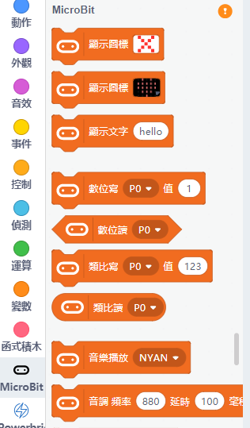
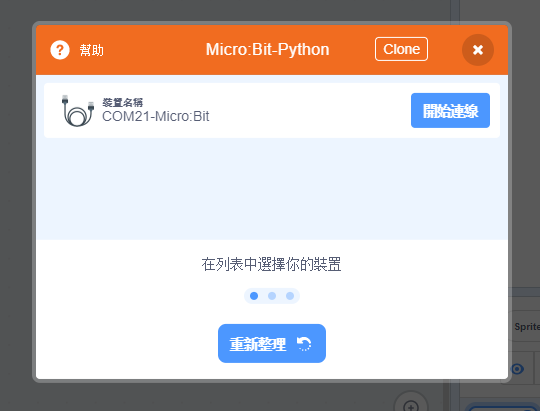
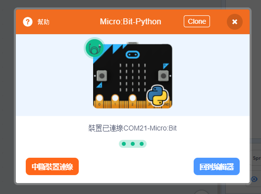
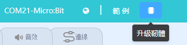
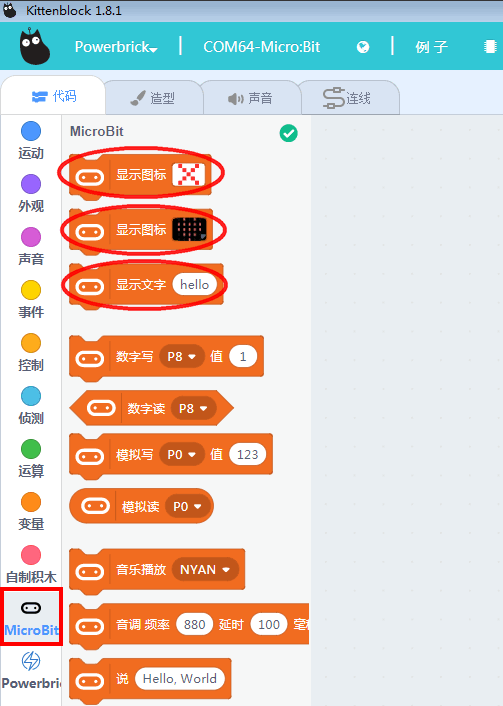
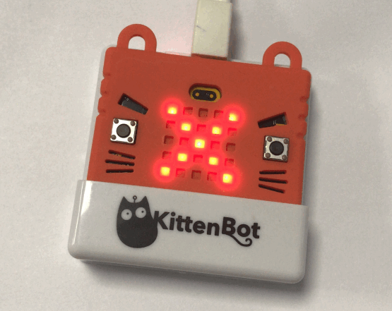

# KittenBlock與Microbit

我們要在Kittenblock上使用Microbit，就首先要與Microbit建立連接。

## 加載PowerBrick插件

離線版與在線版同樣操作。

在左上角小貓logo旁邊的硬件欄選擇PowerBrick，加載Microbit與Powerbrick插件。

## 建立連接

在Microbit的積木欄中按下感嘆號（！）按鈕。

將Microbit用USB線連接到電腦，然後點選『開始連線』。

連接完成！

成功連接後，MicroBit會顯示心形。

假如沒有顯示心形，可以按下升級韌體。

## 連接測試

任意拖曳Microbit的積木，按下積木，Microbit應該會即時有反應。

## 上載程式

在Kittenblock平台上也可以將程式上載到MicroBit，不用永遠連着電腦使用。

按下上方的升級韌體，等待數秒完成即可。

## FAQ

1：為什麼我點擊積木塊沒有反應呢？

首先確保已經連接好Microbit，然後上載韌體再試一試。