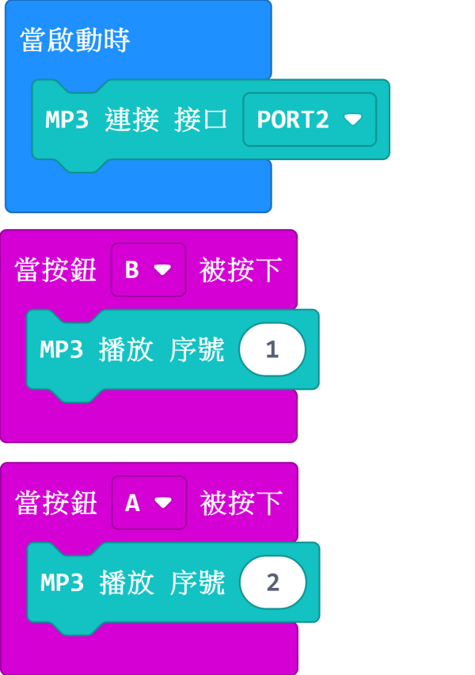

# MP3模組

這是一塊MP3模組，內建小喇叭和microSD卡插槽，可以播放SD卡裏的mp3檔案。上面還有三个按键，播放，前一首，後一首。配合Armourbit使用，可以用程式播放SD卡的指定歌曲等。

## 詳細介紹

## 產品參數

- 支援電壓：3V-5V
- 尺寸：56mm X 24mm X 16mm
- 接口：4pin防反插接口
- 内存卡支持：microSD卡，最大支持32G,FAT32格式
- 支援音頻格式：MP3、WAV
- 自帶按鍵：播放、上一首、下一首
- 音頻上載：將microSD卡插入電腦，將檔案拖曳到卡上即可

## 使用注意事项

- PowerBrick套件並沒有附送microSD卡，請自行購買。
- MP3模組一定要有內存卡，且内存卡中存有可播放的音頻，才可以按按鍵播放音樂。
- 安裝microSD卡時請注意，聽到「卡嚓」一聲才代表安裝好。
- 取出microSD卡時請不要直接用力拔，按一按microSD卡即會彈出。

## 接線方法

將MP3模組用4pin排線連接至Armourbit。

## MakeCode編程教學

加載PowerBrick插件：https://github.com/KittenBot/pxt-powerbrick

### MP3模組積木塊

### 音頻播放

[參考程式下載](www.google.com)

### 音頻播放特定序號

[參考程式下載](www.google.com)

### 音頻播放特定名稱

    名稱只支援英文和數字，長度不能長於8位。

[參考程式下載](www.google.com)