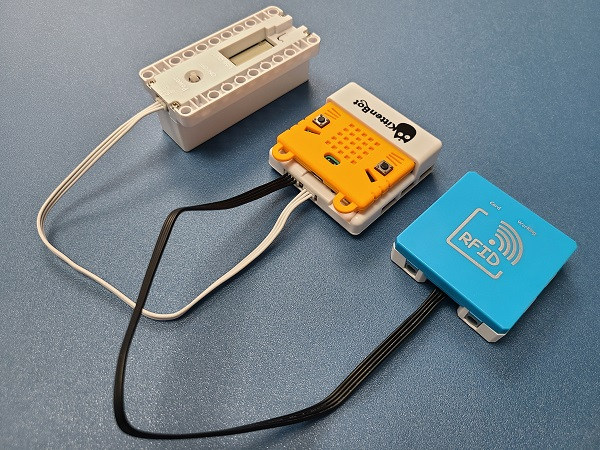
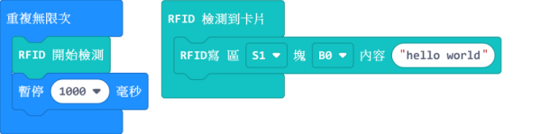
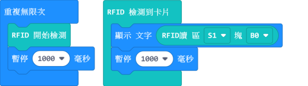
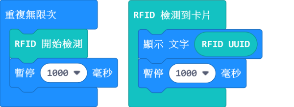

# RFID模組

RFID模組 (HKBM8012L) + RFID卡片 (HKBM8012M)

這是一個RFID模組，可以對套件附有的RFID卡或者空白RFID卡進行讀寫。

附有的RFID卡有1K內存，有16個分區，每個分區有3個區塊可以寫入資料。

## 詳細介紹

## 產品參數

- 支援電壓：3V-5V
- 尺寸：56mm X 56mm X 16mm
- 接口：4pin防反插接口
- 感應距離：大約3cm

## 使用注意事項

- RFID請勿在有強力磁場的環境下使用
- RFID卡與模組之間不能有金屬阻擋，否則無法進行讀寫。
- RFID卡寫入大量數據的速度比較慢，請靜待一下，等數據成功寫入再拿去RFID卡。
- 八達通卡身份證之類的卡因為資料被加密所以不能進行寫入數據，只可以讀取UID號碼（每張卡也有獨有的ID）。

## 接線方法

將RFID模組用4pin排線連接至Armourbit的I2C接口。

## MakeCode編程教學

加載PowerBrick插件：https://github.com/KittenBot/pxt-powerbrick

### RFID模組積木塊

### RFID卡片寫入

[參考程式下載](www.google.com)

### RFID卡片讀取

[參考程式下載](www.google.com)

### RFID讀取UID

每張卡的UID也不同，請自行抄下你自己卡片的UID。

[參考程式下載](www.google.com)

##UID身份辨別

我們可以用UID作身份辨別。

    這裡請使用您卡片的UID。

[參考程式下載](www.google.com)

### Makecode教學短片

## KittenBlock編程教學

### 加載PowerBrick插件

離線版與在線版同樣操作。

在左上角小貓logo旁邊的硬件欄選擇PowerBrick，加載Microbit與Powerbrick插件。

### RFID積木塊

### RFID卡片寫入

[參考程式下載](www.google.com)

### RFID卡片讀取

[參考程式下載](www.google.com)

### RFID讀取UID

[參考程式下載](www.google.com)

### UID身份辨別

    這裡請使用您卡片的UID。
    
[參考程式下載](www.google.com)

## FAQ

1：為什麼我點擊積木塊沒有反應呢？

首先確保已經連接好Microbit，然後上載韌體再試一試。