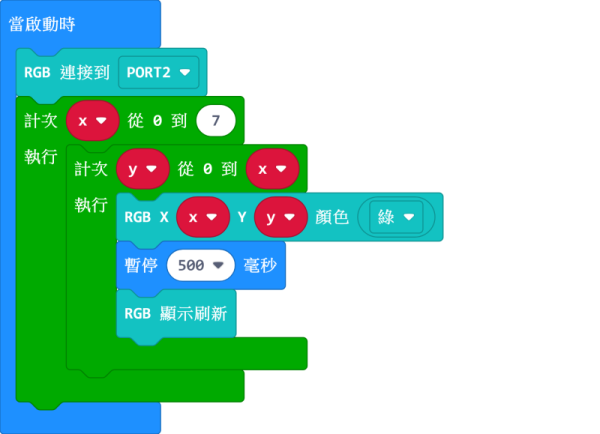

# 全彩點陣模組(上)

這是一塊8x8的全彩點陣屏，可以單獨控制任意一點的顏色或者整個屏幕的顏色。支持多塊點陣屏串聯，组成16x16或者8x32等點陣屏，令顯示效果更加豐富。

## 詳細介紹

## 產品參數

- 支援電壓：3V-5V
- 尺寸：56mm X 24mm X 16mm
- 接口：4pin防反插接口
- 像素：8x8全彩

## 使用注意事項

- 點陣屏上有兩個接口，輸入和輸出，單獨使用，請使用輸入接口與Armourbit連接。
- 點陣屏進行串聯需要將第一塊點陣屏的輸出與下一塊的輸入接口連接。
- 用電池盒時最多支援串聯4塊點陣屏。如需接更多，需外接電源，或者降低點陣亮度，以此減少電流。
- 長時間使用彩色點陣屏請注意散熱。

## 接線方法

將RGB模組用4pin排線連接至Armourbit。

## MakeCode編程教學

加載PowerBrick插件：https://github.com/KittenBot/pxt-powerbrick

### RFID模組積木塊

### 單色點亮

[參考程式下載](www.google.com)

### 彩虹色點亮

[參考程式下載](www.google.com)

### 單燈點亮

[參考程式下載](www.google.com)

### 圖案點亮

[參考程式下載](www.google.com)

## 串聯與圖像化編輯器教學

串聯情況下支援圖像化編輯器，詳情請參考流光溢彩屏教學。

[按此前往](../../accessories/LEDMatrixT2.md)