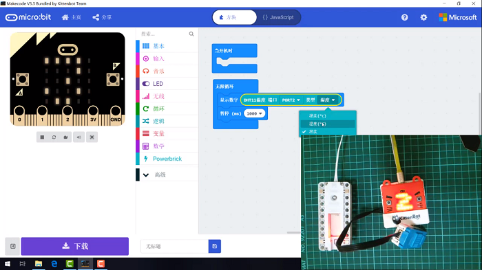
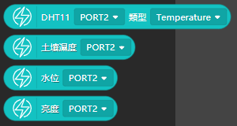

# 土壤濕度感應器

土壤濕度感應器 (HKBM8012H)

這是一塊土壤濕度感應器它可以測量土壤的濕度，泥土越乾燥數值越大。

## 使用注意事項：

- 若長期不使用感應器，請妥善放置乾燥地方保管，防止潮濕被氧化。
- 感應器上有最大限位線，請勿過度插入土壤或者水中，避免損壞電路。

## 接線方法

將溫度濕度感應器用4pin排線連接至Armourbit，然後用3pin排線將感應器連接至溫度濕度感應器。

## MakeCode編程教學

加載PowerBrick插件：https://github.com/KittenBot/pxt-powerbrick

### 土壤濕度感應器積木塊:

### 土壤濕度探測編程

[參考程式下載](https://bit.ly/PowerbrickM3_01Hex)

### Makecode教學短片

## KittenBlock編程教學

### 加載PowerBrick插件

離線版與在線版同樣操作。

在左上角小貓logo旁邊的硬件欄選擇PowerBrick，加載Microbit與Powerbrick插件。

### 環境積木塊

### 土壤濕度探測

[參考程式下載](www.google.com)