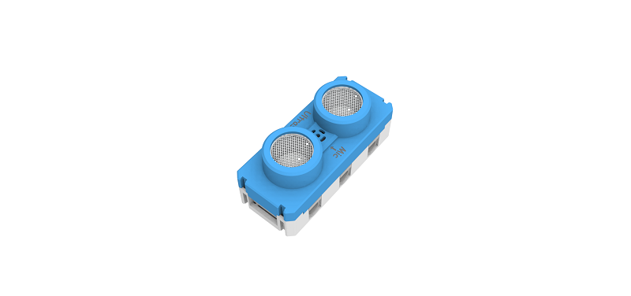
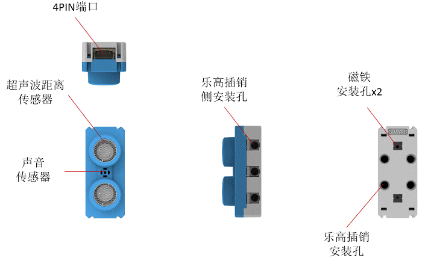
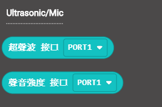

# 超聲波聲音模組

超聲波聲音模組 (HKBM8012K)

這模組包含了超聲波感應器和咪高峰。它可以用超聲波來測量與物件的距離，咪高峰可以探測環境聲音的強弱。

## 詳細介紹

## 產品參數

- 支援電壓：3V-5V
- 尺寸：56mm X 24mm X 24mm
- 接口：4PIN防反接排線
- 超聲波探測距離：4cm-200cm（推薦範圍）
- 聲音模擬數值範圍：0-1023

## 使用注意事項

- 超聲波距離測量要求物件表面比較平整，平面盡量與超聲波模組垂直。超聲波的發射是一個扇形，所以要注意測量距離之間是否有其他障礙物遮擋。
- 咪高峰只能檢測環境聲音的強度，並非分貝值，測量分貝值需要比較專業的儀器。咪高峰只是檢測瞬時聲音的強弱數值。

## 接線方法

將超聲波聲音模組用4pin排線連接至Armourbit。

## MakeCode編程教學

加載PowerBrick插件：https://github.com/KittenBot/pxt-powerbrick

### 超聲波聲音模組積木塊:

### 距離檢測編程

[參考程式下載](www.google.com)

### 距離檢測編程

[參考程式下載](www.google.com)

## 模組演示

