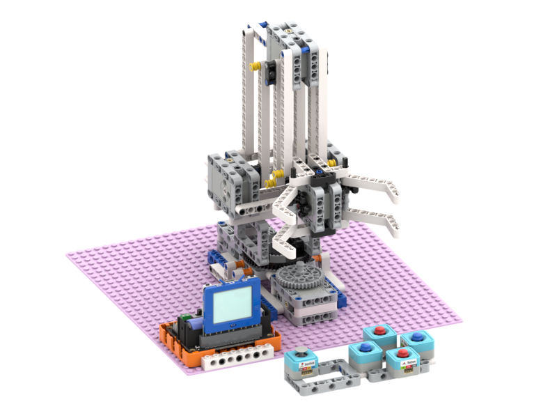
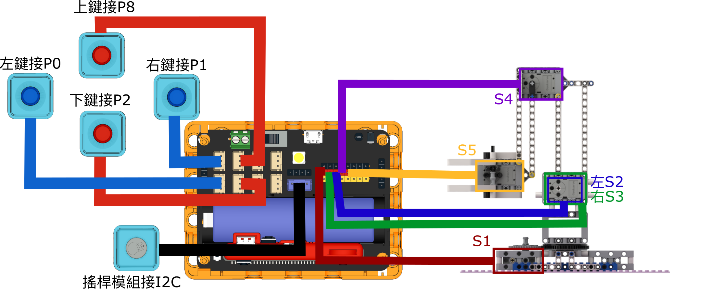
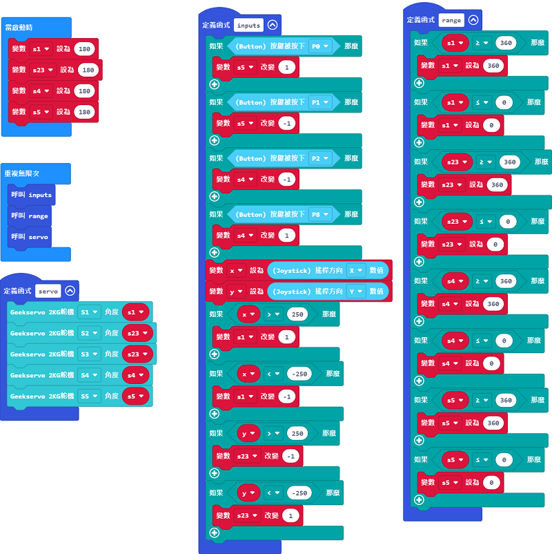
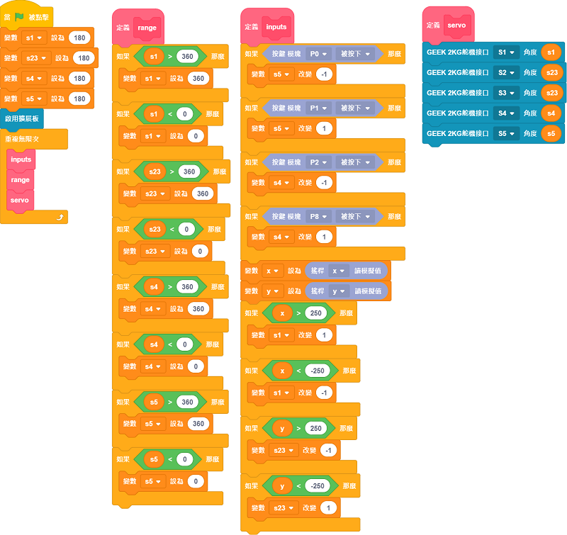

# 積木版機械臂

積木版機械臂是一套機械套件，套件可以搭建出一隻以5隻Geekservo 2KG舵機驅動的活動機械臂。

## 套件內容

1. Robotbit Edu x1
2. 18650鋰電池 x1
3. Geekservo 2KG舵機 x5
4. Sugar 按鍵模組 x4
5. Sugar 搖桿模組 x1
6. 積木包
7. 連接線

## 套件特色

- 採用2KG舵機，確保機械臂運作更加穩定可靠
- 機械結構讓學生了解機械臂例如槓桿力學等的機械工程知識
- 動手搭建，讓學生動手組裝機械臂，提升工程技能
- 採用積木結構，靈活改裝適合不同應用

## 組裝教學

[下載組裝說明書(右擊->另存連結)](https://github.com/kittenbothk/kittenbothk/raw/master/Kits/lego_robot_arm/lego_robot_arm.pdf)

## 參考接線

### Robotbit EDU

## 參考程式

### Micro:bit參考程式

[參考程式](https://makecode.microbit.org/_A9cCYFVWr3e3)

#### 插件版本與更新

插件可能會不定時推出更新，改進功能。亦有時候我們可能需要轉用舊版插件才可使用某些功能。

詳情請參考: [Makecode插件版本更換](../Makecode/makecode_extensionUpdate)

### 未來板參考程式

### KittenBlock參考程式

[參考程式(右擊->另存連結)](https://github.com/kittenbothk/kittenbothk/raw/master/Kits/lego_robot_arm/robot_arm.sb3)

### Python參考程式

    #/bin/python
    
    from future import *
    from sugar import *
    import robotbit
    
    x = 0
    s1 = 0
    s23 = 0
    s4 = 0
    s5 = 0
    y = 0

    def inputs():
      global x,s1,s23,s4,s5,y
    
      if Button("P1").value() == 0:
        s5 += -1
      if Button("P0").value() == 0:
        s5 += 1
      if Button("P2").value() == 0:
        s4 += -1
      if Button("P8").value() == 0:
        s4 += 1
      x = Joystick().value('x')
      y = Joystick().value('y')
      if x > 250:
        s1 += 1
      if x < -250:
        s1 += -1
      if y > 250:
        s23 += -1
      if y < -250:
        s23 += 1
    
    def range():
      global x,s1,s23,s4,s5,y
    
      if s1 > 360:
        s1 = 360
      if s1 < 0:
        s1 = 0
      if s23 > 360:
        s23 = 360
      if s23 < 0:
        s23 = 0
      if s4 > 360:
        s4 = 360
      if s4 < 0:
        s4 = 0
      if s5 > 360:
        s5 = 360
      if s5 < 0:
        s5 = 0
    
    def servo():
      global x,s1,s23,s4,s5,y
      robot.geekServo2kg(1, s1)
      robot.geekServo2kg(2, s23)
      robot.geekServo2kg(3, s23)
      robot.geekServo2kg(4, s4)
      robot.geekServo2kg(5, s5)

    
    s1 = 180
    s23 = 180
    s4 = 180
    s5 = 180
    
    robot = robotbit.RobotBit()
    while True:
      inputs()
      range()
      servo()

[參考程式(右擊->另存連結)](https://github.com/kittenbothk/kittenbothk/raw/master/Kits/lego_robot_arm/robot_arm.py)

