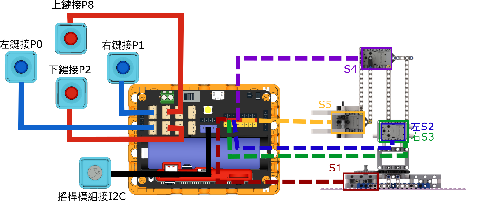

# 積木版機械臂

積木版機械臂是一套機械套件，套件可以搭建出一隻以5隻Geekservo 2KG舵機驅動的活動機械臂。

## 套件內容

1. Robotbit Edu x1
2. 18650鋰電池 x1
3. Geekservo 2KG舵機 x5
4. Sugar 按鍵模組 x4
5. Sugar 搖桿模組 x1
6. 積木包
7. 連接線

## 套件特色

- 採用2KG舵機，確保機械臂運作更加穩定可靠
- 機械結構讓學生了解機械臂例如槓桿力學等的機械工程知識
- 動手搭建，讓學生動手組裝機械臂，提升工程技能
- 採用積木結構，靈活改裝適合不同應用

## 組裝教學

[下載組裝說明書(右擊->另存連結)](https://github.com/kittenbothk/kittenbothk/raw/master/Kits/lego_robot_arm/lego_robot_arm.pdf)

## 參考接線

### Robotbit EDU

## 參考程式

### Micro:bit參考程式

[參考程式](https://makecode.microbit.org/_A9cCYFVWr3e3)

#### 插件版本與更新

插件可能會不定時推出更新，改進功能。亦有時候我們可能需要轉用舊版插件才可使用某些功能。

詳情請參考: [Makecode插件版本更換](../Makecode/makecode_extensionUpdate)

### 未來板參考程式

[參考程式(右擊->另存連結)](https://github.com/kittenbothk/kittenbothk/raw/master/Kits/lego_robot_arm/robot_arm.sb3)

