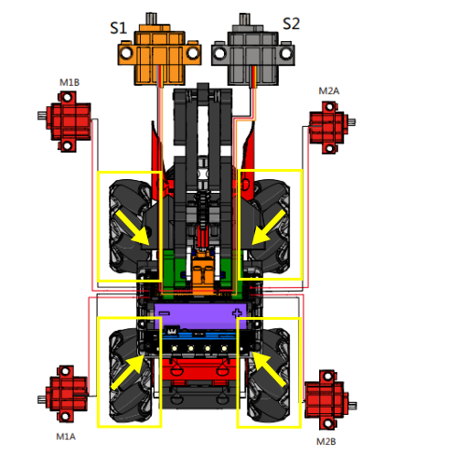

# 麥輪炮台車

## 組裝說明書和參考程式

[組裝說明書下載](https://bit.ly/MRMacanumWheelBuildingInstruction)

### 組裝注意！！

#### 麥卡納姆輪和一般輪子不同，四個輪子的方向必須要按照說明書安裝。

[參考程式- 主體](https://makecode.microbit.org/_UD7XueM2oC2o)

[參考程式- JoyFrog遊戲手柄](https://makecode.microbit.org/_ddya6e8pADDs)

## 模型玩法

### JoyFrog遊戲手柄：

1. 將橡筋裝填在砲台的齒輪上。
2. 將電源模型打開。
3. 利用手掣上的搖桿控制機械車的上下左右移動。
4. 按Y切換至轉向模式，控制機械車的角度。
5. 按A和B調較炮台的角度。
6. 按X發射橡筋。