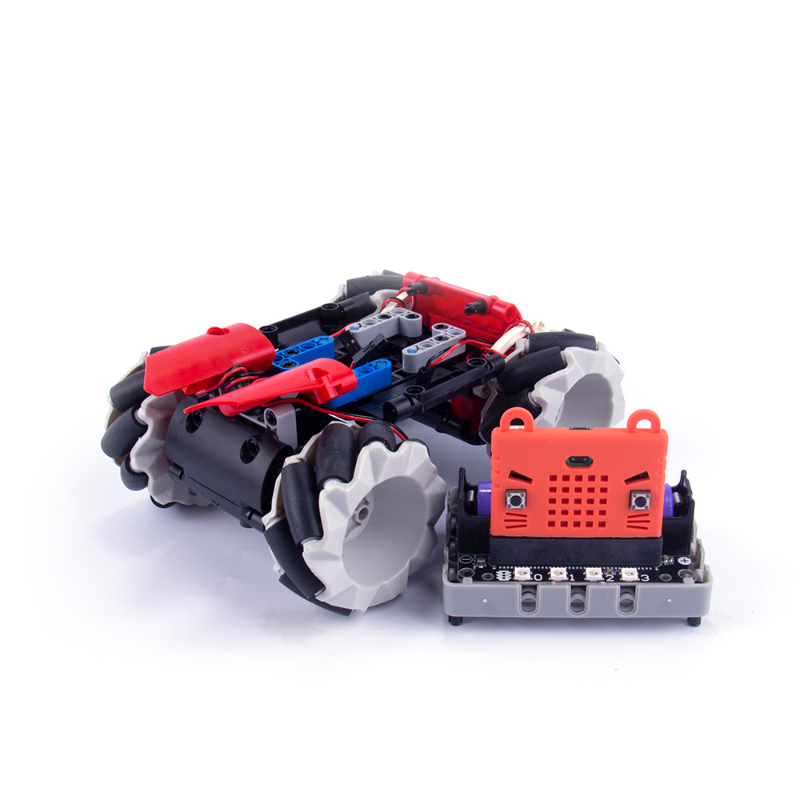

# 基礎麥輪車

## 組裝說明書和參考程式

[組裝說明書下載]()

[參考程式- 主體]()

[參考程式- Microbit搖控]()

[參考程式- JoyFrog遊戲手柄]()

## 模型玩法

### Microbit搖控：

1. 將電源模型打開。
2. 按下Microbit的B按鍵與機械車連接。
3. 利用陀螺儀控制機械車的上下左右移動。
4. 按A切換至轉向模式，控制機械車的角度。

### JoyFrog遊戲手柄：

1. 將電源模型打開。
2. 按下手掣的B按鍵與機械車連接。
3. 利用手掣上的搖桿控制機械車的上下左右移動。
4. 按A切換至轉向模式，控制機械車的角度。