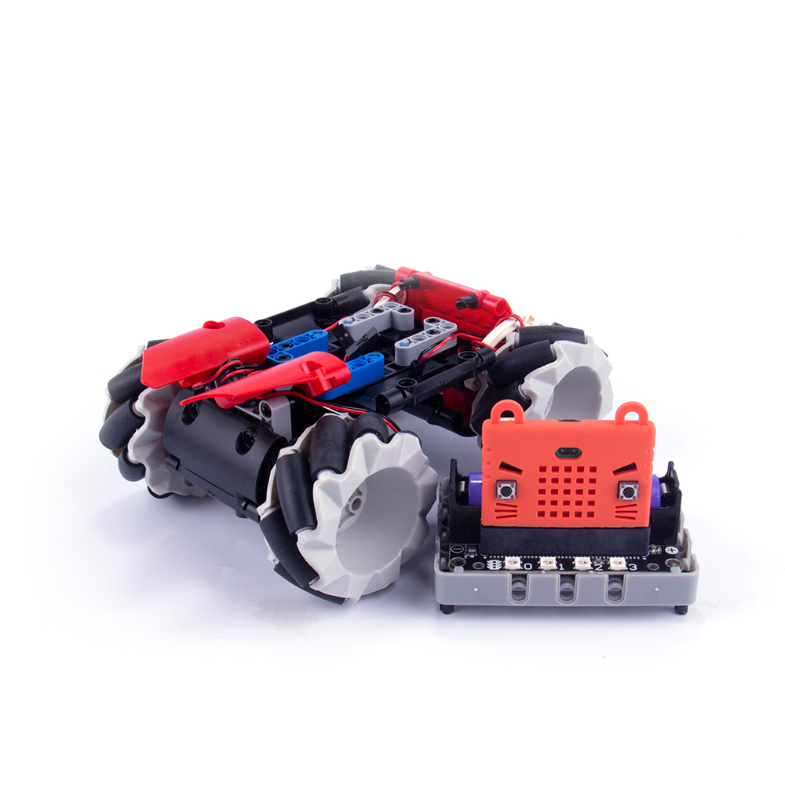
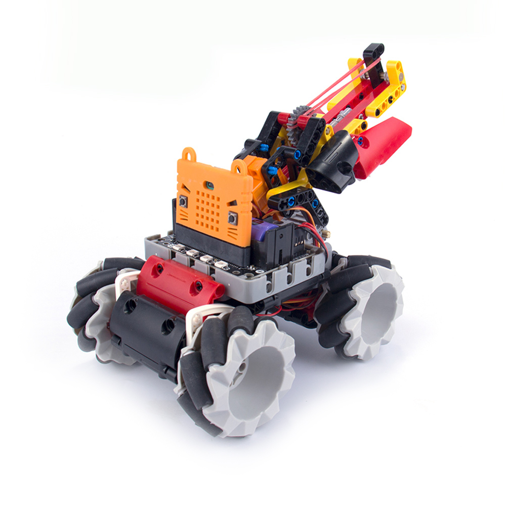
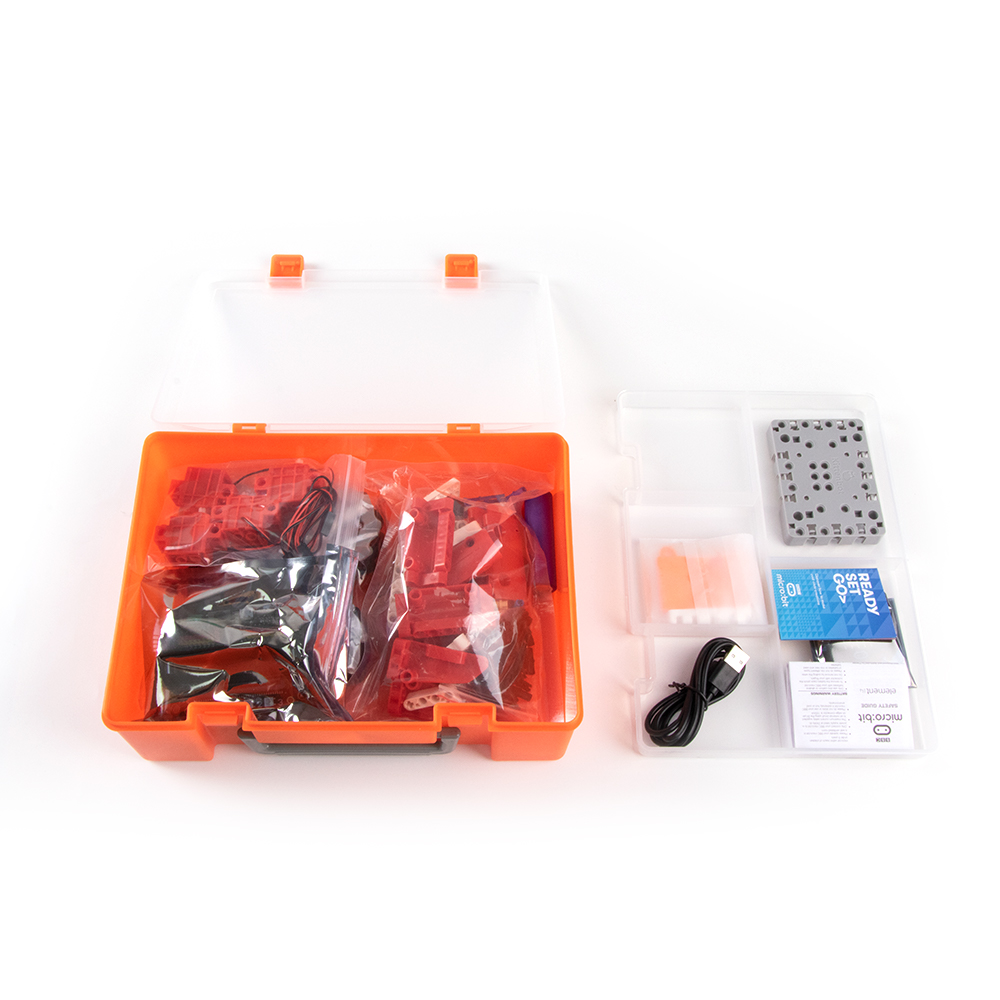
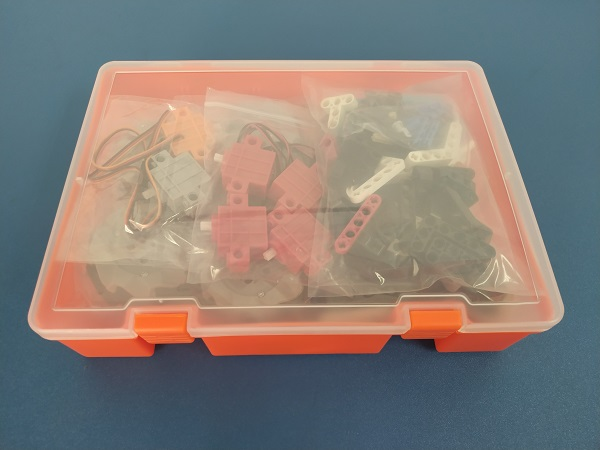
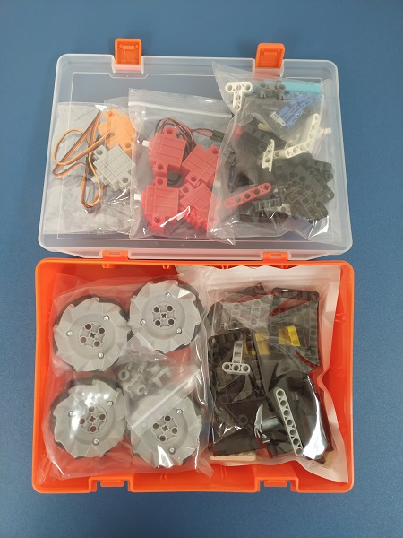
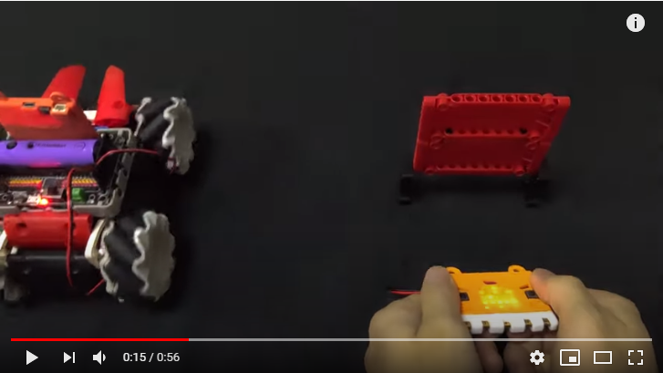

# 四驅麥輪車套件介紹

### 四驅麥輪車套件基礎版 (HKBK8021A)

### 四驅麥輪車套件射擊版 (HKBK8032B)

## 產品介紹

四驅麥輪車是為Microbit而設計的套件，是一套進階的車類套件。套件內的麥卡納姆輪有著全方位移動的特性，容許大家設計一些十分靈活的機械人，在一般車類機械人無法使用的狹窄環境大派用場，它奇妙的移動特性更可以教大家這種新型車輪的運作原理。

這套套件有兩種版本，基礎版和射擊版。射擊版包含基礎版的所有部件，比起基礎版多了額外的積木包和舵機，可以組裝進階版的射擊炮台；套件還附有一隻JoyFrog手掣，實現更加準確的遙控控制。

## 四驅麥輪車套件內容

- Robotbit擴展板x1
- GeekServo電機x4
- 麥卡納姆輪x4
- 麥輪車軸轉接器x4
- 積木包x1
- 18650鋰電池x1
- USB數據線x1
- Microbit矽膠套x1
- GeekServo舵機x1 (只限射擊版)
- GeekServo 360續轉舵機x1 (只限射擊版)
- 炮台擴展積木包x1 (只限射擊版)
- JoyFrog手掣x1 (只限射擊版)
- 電池盒x1 (只限射擊版)
- 橡筋包x1 (只限射擊版)

## 產品特色

- 基於Microbit的圖形化編程，更容易上手
- 兼容樂高積木，擴展性高
- 全方位移動，新穎兼靈活性高
- 支援MakeCode和Kittenblock編程

## 產品參數

- 包裝盒尺寸：251x182x81mm
- 重量：880g(基礎版)，1140g(射擊版)
- 麥輪尺寸：64mm外經

## 介紹短片

