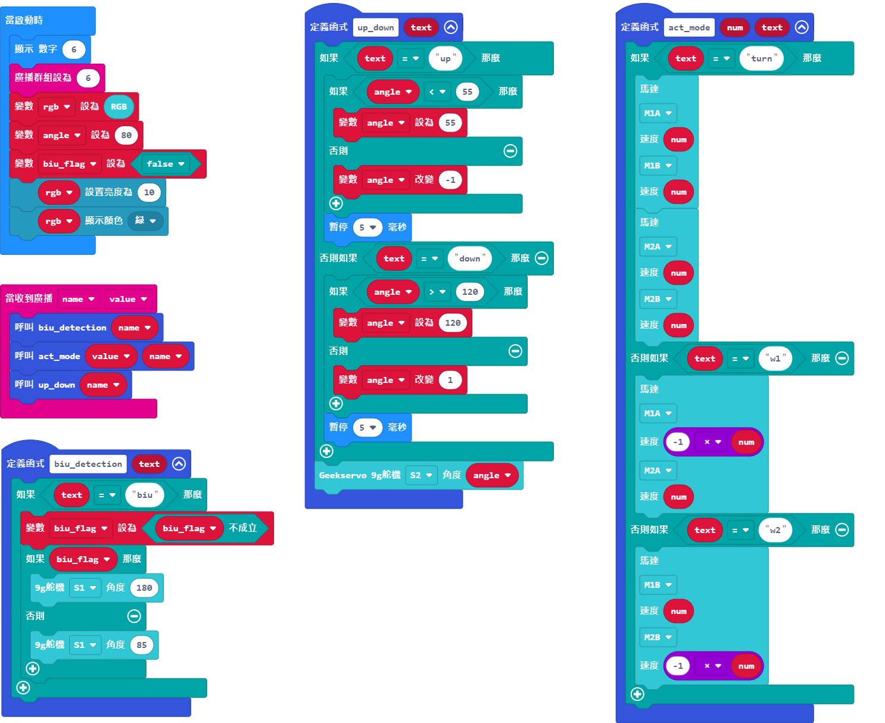
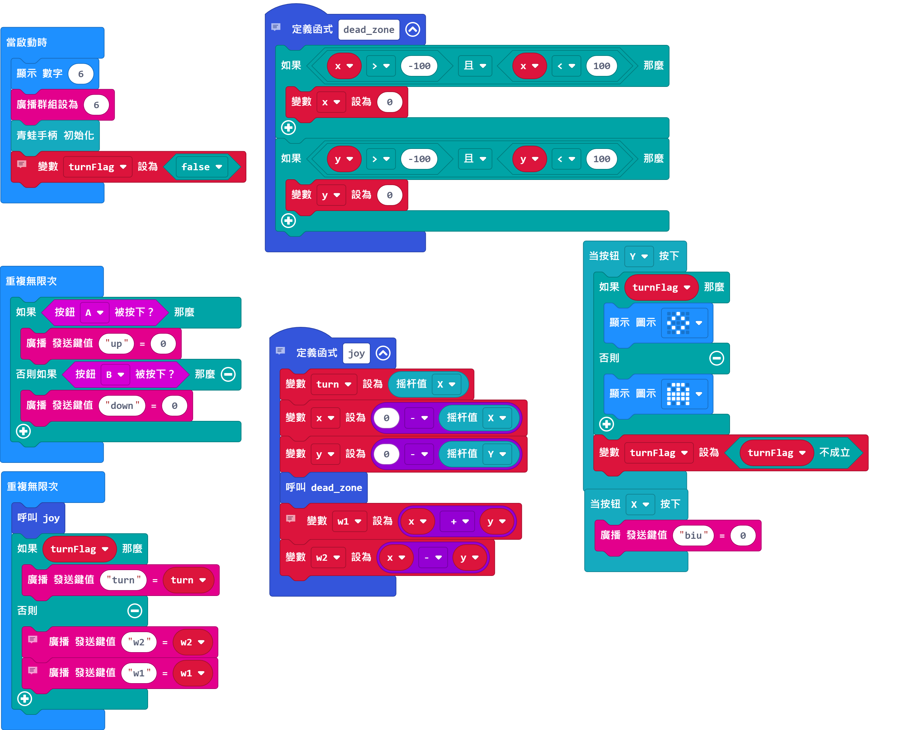

# 參考程式與套件教學

## 麥輪車主體參考程式

[參考程式下載](https://makecode.microbit.org/_iYvD2CDYaM4Y)

## 麥輪車JoyFrog控制器參考程式

[參考程式下載](https://makecode.microbit.org/_2yoUfrd7JHvV)

## 參考程式使用方法

1. 將橡筋裝填在砲台的齒輪上。
2. 將電源模型打開。
3. 利用手掣上的搖桿控制機械車的上下左右移動。
4. 按Y切換至轉向模式，控制機械車的角度。
5. 按A和B調較炮台的角度。
6. 按X發射橡筋。