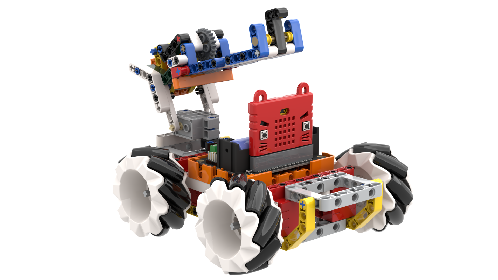
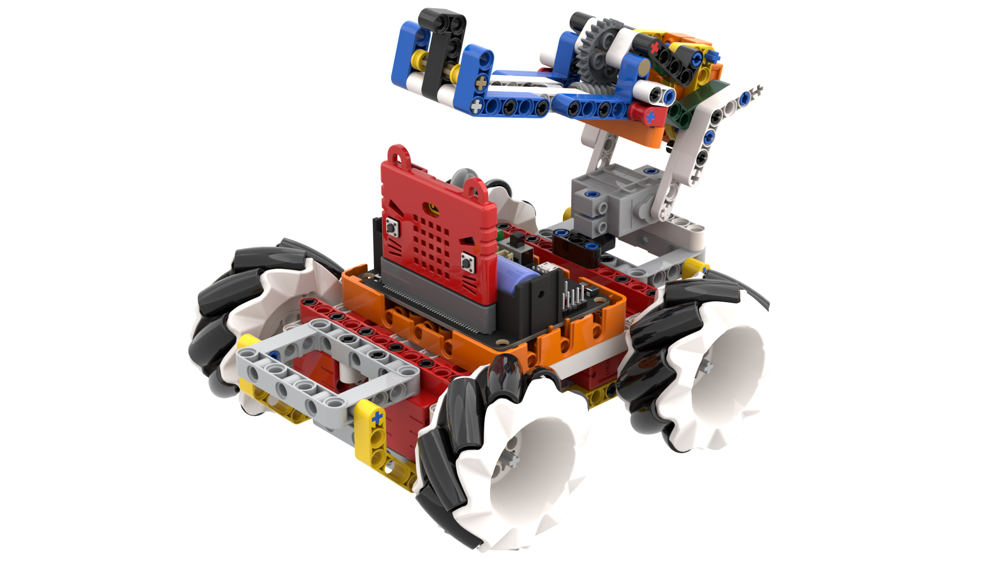
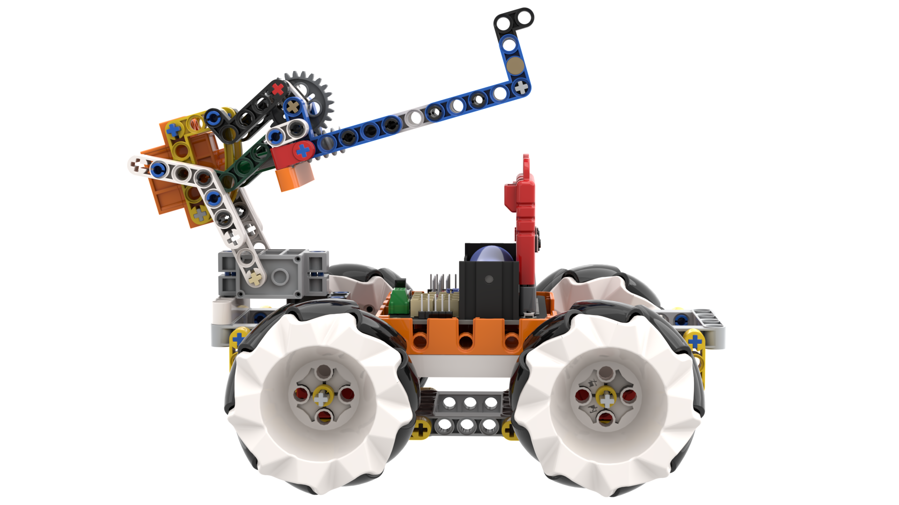
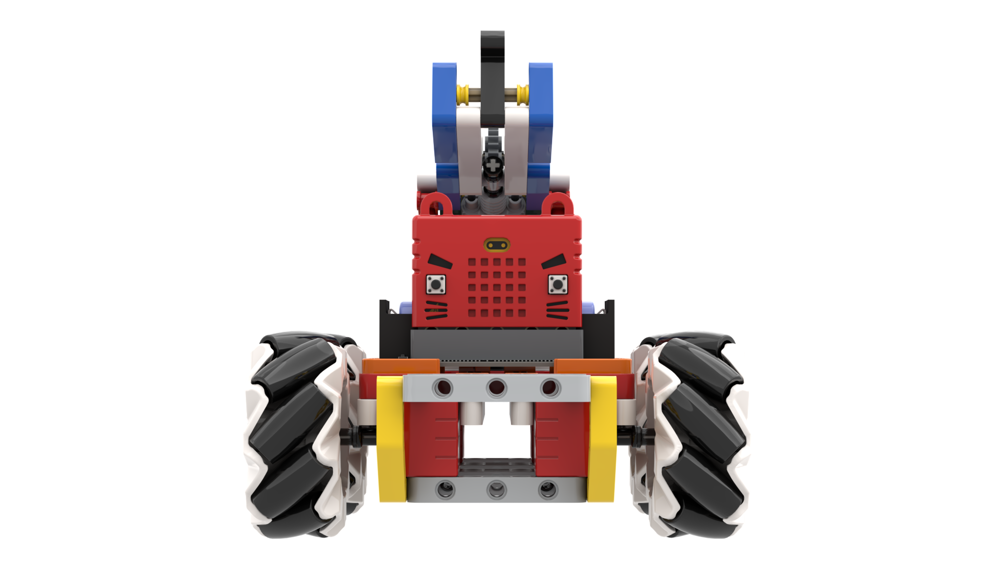

# 四驅麥輪車2KG版

四驅麥輪車2KG版是普通四驅麥輪車的升級版，配備2KG GeekServo紅色電機，令小車的性能大幅提升。

## 產品特色

- 基於Microbit的圖形化編程，更容易上手
- 兼容樂高積木，擴展性高
- 全方位移動，新穎兼靈活性高
- 使用2KG電機，性能強勁
- 支援MakeCode和Kittenblock編程

## 套件內容

- Robotbit Edu擴展板 x1
- 塑膠積木包 x1
- GeekServo 2KG電機 x4
- 麥輪+麥輪轉接器 x4
- GeekServo O360續轉舵機 x1
- 炮台擴展包 x1
- 18650鋰電池 x1

## 產品展示

