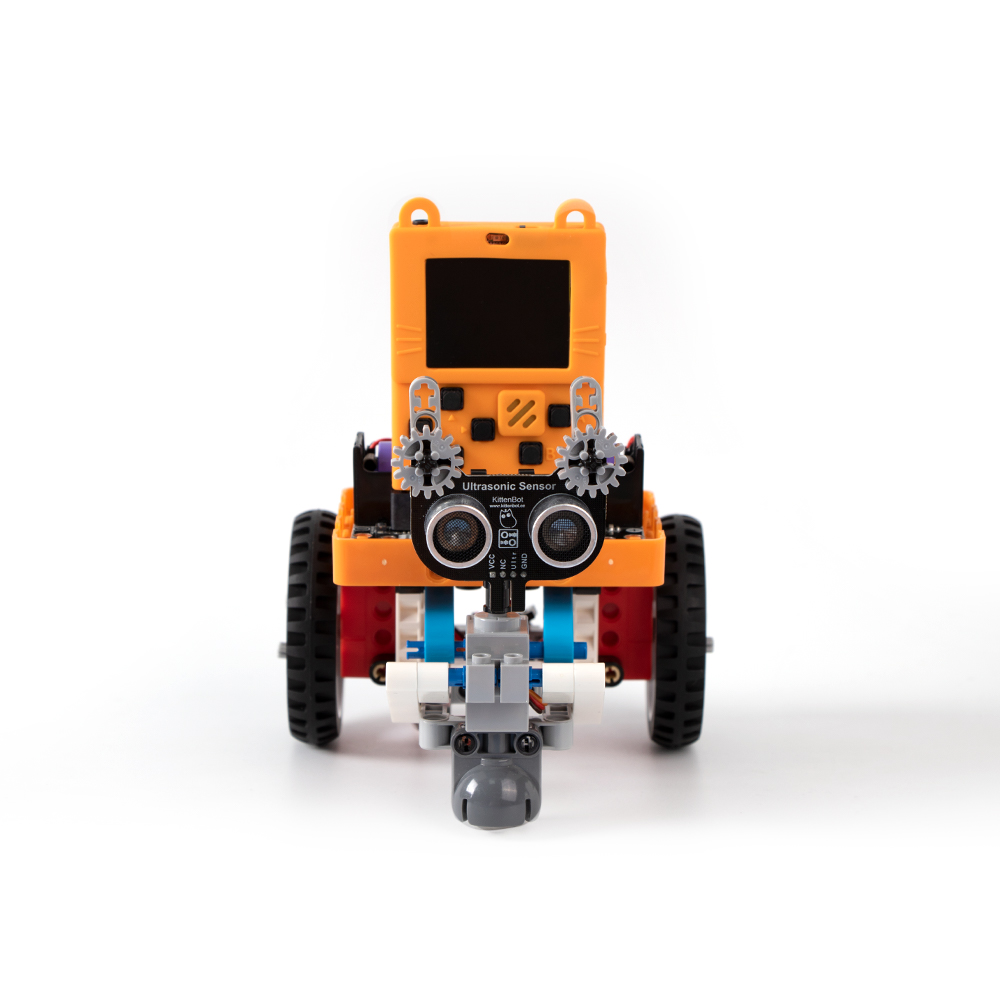
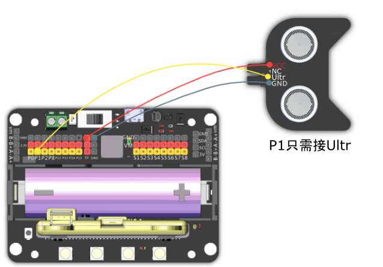

# 10. 避障智貓

## 教材資源包下載

包括說明書： [資源包下載地址](https://bit.ly/AIHealthCareSetBuildingGuide)

## 參考接線

## 參考程式

[避障智貓參考程式](https://makecode.com/_eDEbk6C7yUjH)

[參考程式資源包下載地址](https://bit.ly/AIHealthCareSetHex)

## 模型玩法

車子會在地上行走，遇到障礙物時會停下來，探測出路然後繼續行走。

