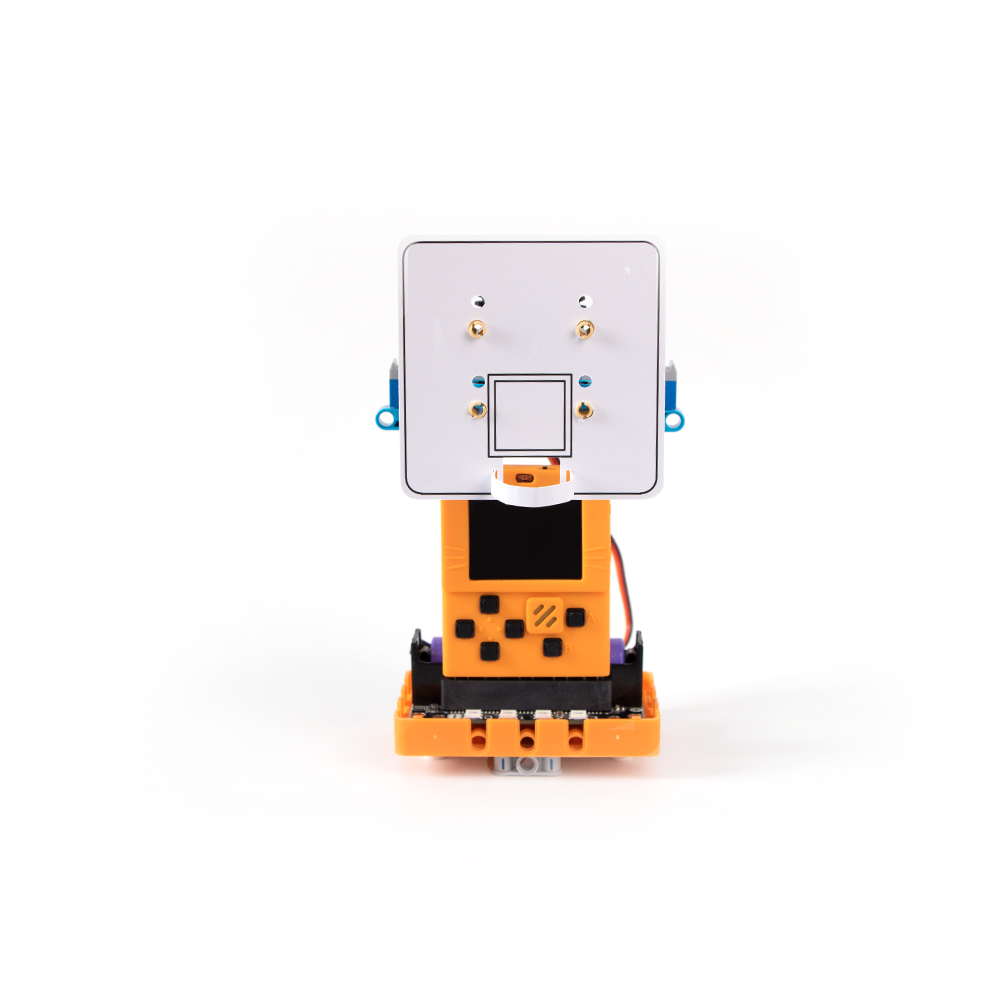
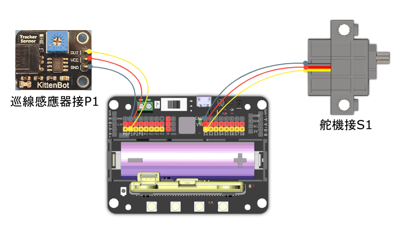

# 5. 灌籃高手

## 教材資源包下載

包括說明書： [資源包下載地址](https://bit.ly/AIHealthCareSetBuildingGuide)

## 參考接線

## 參考程式

[灌籃高手參考程式](https://makecode.com/_LzWXEo3V5PgM)

[參考程式資源包下載地址](https://bit.ly/AIHealthCareSetHex)

## 模型玩法

打開電源後，屏幕會開始倒數，籃球架會左右移動。嘗試在限時之內入球數量創新高吧！

## 疑難排解

### 1: 為什麼我巡線感應器的靈敏度這麼低？

### 巡線感應器的檢測距離可以調較，靈敏度設定位於感應器上的藍色旋鈕，請使用螺絲批調節檢測距離(向左調高，向右調低)。

