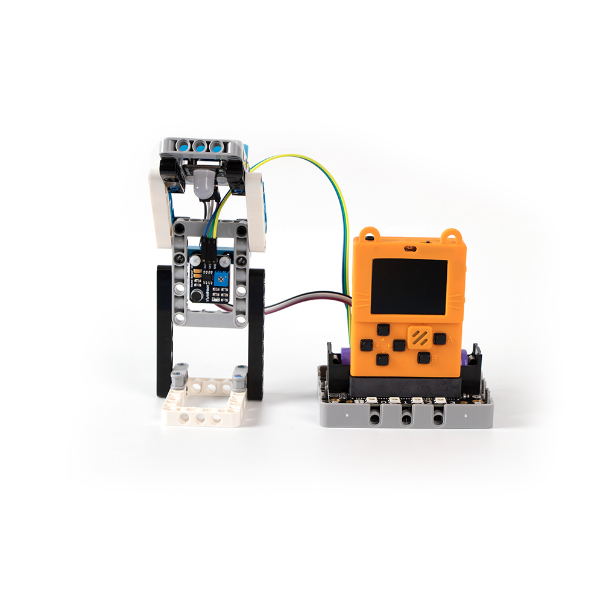
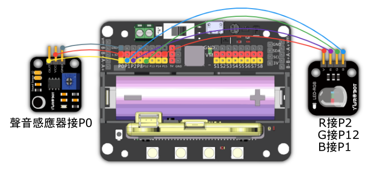

# 7. 聲控彩燈

## 教材資源包下載

包括說明書： [資源包下載地址](https://bit.ly/AIHealthCareSetBuildingGuide)

## 參考接線

## 參考程式

[聲控彩燈參考程式](https://makecode.com/_Jbv0Ad7CcJah)

[參考程式資源包下載地址](https://bit.ly/AIHealthCareSetHex)

## 模型玩法

對著模型拍手，燈泡會轉換顏色。