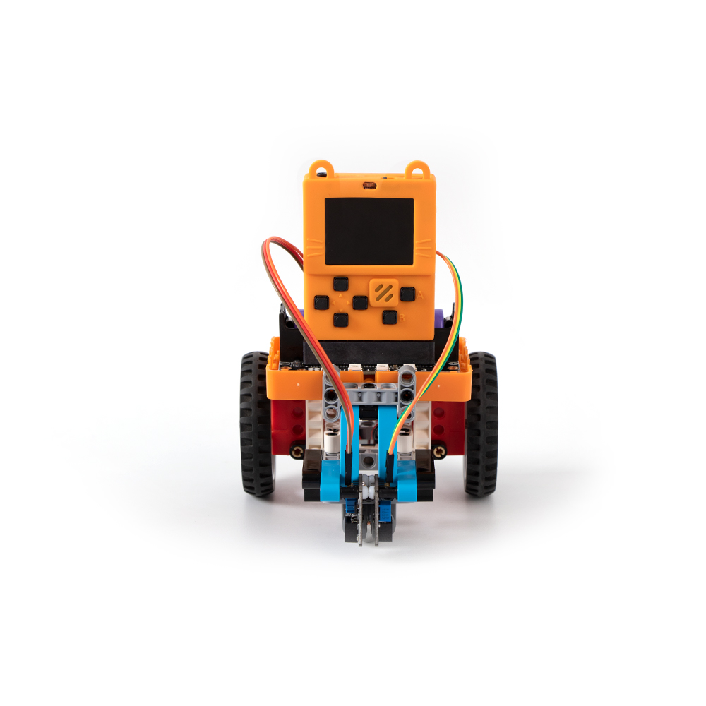
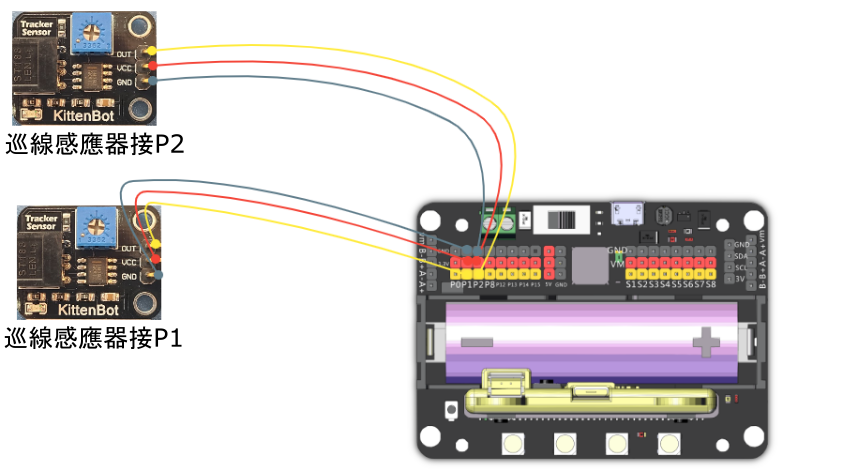
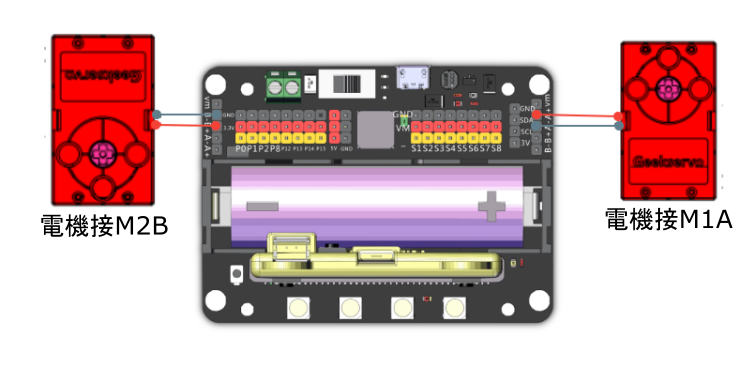

# 9. 巡邏智械

## 教材資源包下載

包括說明書： [資源包下載地址](https://bit.ly/AIHealthCareSetBuildingGuide)

## 參考接線

## 參考程式

[巡邏智械參考程式](https://makecode.com/_Esy3C4PssDDE)

[參考程式資源包下載地址](https://bit.ly/AIHealthCareSetHex)

## 模型玩法

車子會自動跟著地上的黑線路線行走。

## 疑難排解

### 1: 為什麼我巡線感應器的靈敏度這麼低？

### 巡線感應器的檢測距離可以調較，靈敏度設定位於感應器上的藍色旋鈕，請使用螺絲批調節檢測距離(向左調高，向右調低)。以巡線車來說，請調較感應器直至在白色區域上會亮紅燈，在黑色線段上會熄滅。

