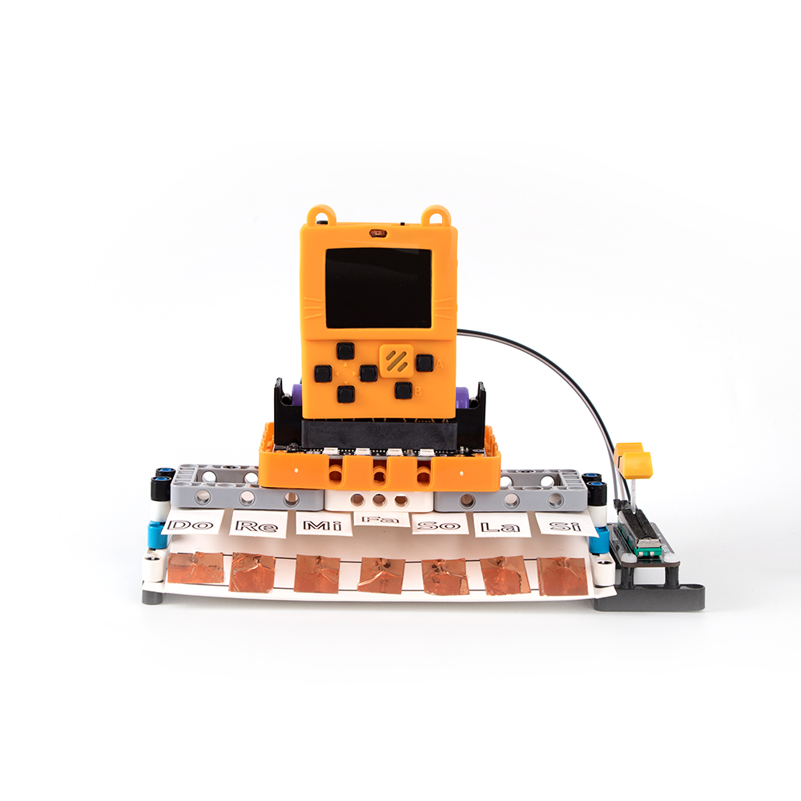
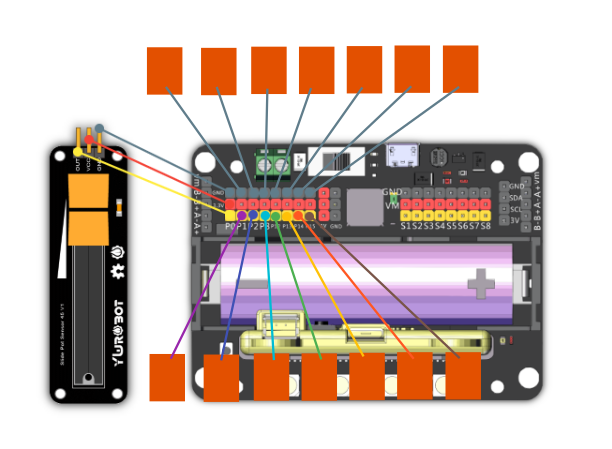

# 6. 鋼琴大師

## 教材資源包下載

包括說明書： [資源包下載地址](https://bit.ly/AIHealthCareSetBuildingGuide)

## 參考接線

## 參考程式

[鋼琴大師參考程式](https://makecode.com/_WYvCypA0AJ8L)

[參考程式資源包下載地址](https://bit.ly/AIHealthCareSetHex)

## 模型玩法

按下琴鍵發出音調，使用滑動電位器調整音調的高低。

