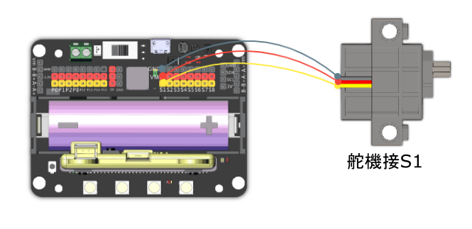

# 2. 拔河比賽

## 教材資源包下載

包括說明書： [資源包下載地址](https://bit.ly/AIHealthCareSetBuildingGuide)

## 參考接線

## 參考程式

[拔河比賽參考程式](https://makecode.com/_hfm1J9JMs8EA)

[參考程式資源包下載地址](https://bit.ly/AIHealthCareSetHex)

## 模型玩法

這是一個雙人遊戲，兩位玩家分別使用A鍵和左方向鍵控制，不停按下按鍵，直至對方越過白線落敗為止。