# 紙電路教學套件零件清單

紙電路教學套件內有12節課的電子元件，總共47塊，請點算一下確保沒有遺漏。

## 電子零件清單

### 鈕扣電池座

#### 數量：12

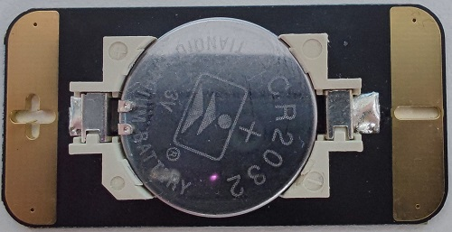

### 自鎖按键開關

#### 數量：6

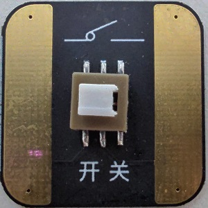

### 單色LED燈

#### 紅色數量：3
#### 黃色數量：2
#### 藍色數量：3
#### 綠色數量：1

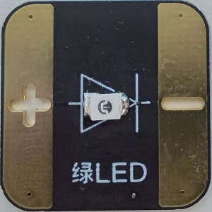

### 電位器

#### 數量：1

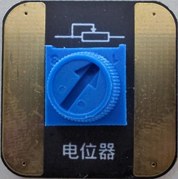

### 音樂盒

#### 數量：1

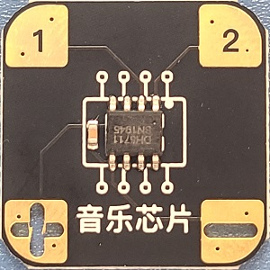

### 喇叭

#### 數量：1

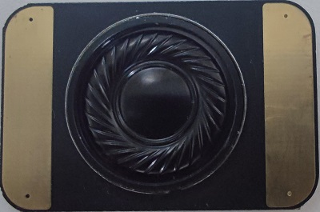

### RGB LED

#### 數量：1

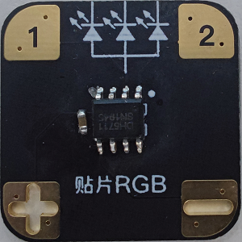

### 3位數碼開關

#### 數量：1

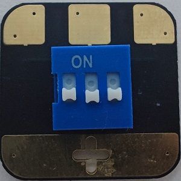

### 7位數碼開關

#### 數量：1

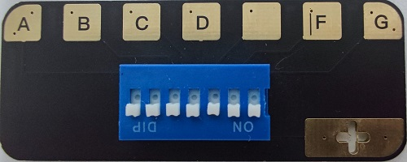

### 數字顯示

#### 數量：1

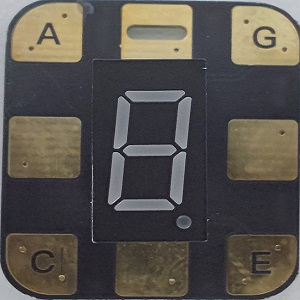

### 輕觸開關

#### 數量：2

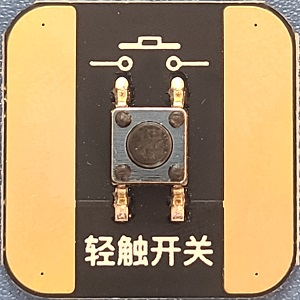

### 蜂鳴器

#### 數量：1

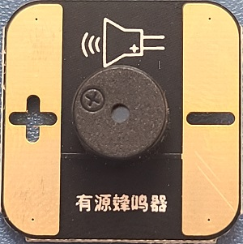

### 7彩LED

#### 數量：1

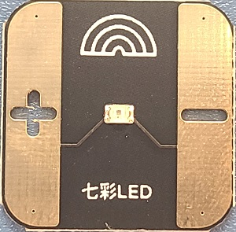

### 磁簧開關

#### 數量：1

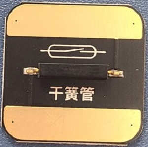

### 100K 電阻

#### 數量：1

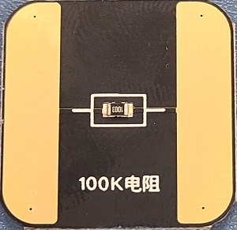

### 10K 電阻

#### 數量：2

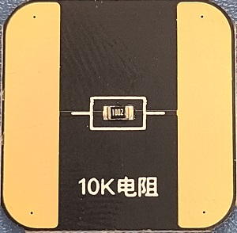

### 光敏電阻

#### 數量：1

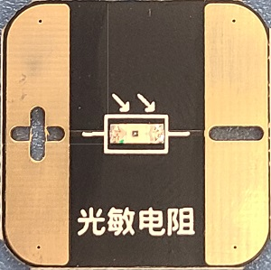

### 三極管

#### 數量：2

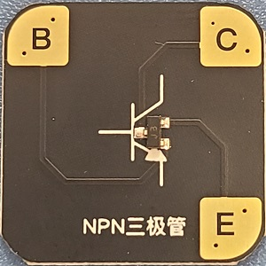

### 10uf 電容

#### 數量：1

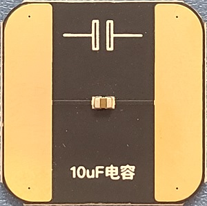

### 彩虹LED

#### 數量：1

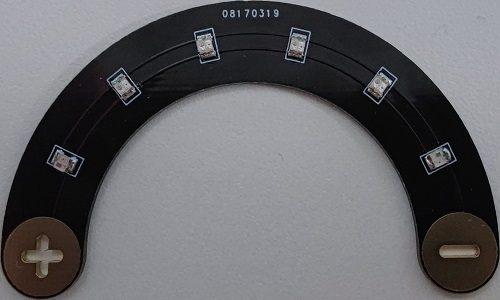