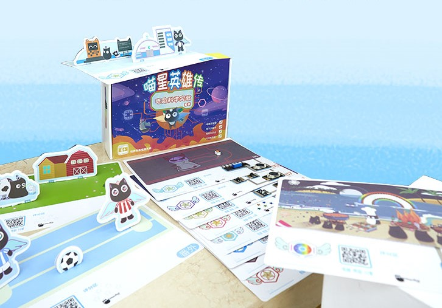
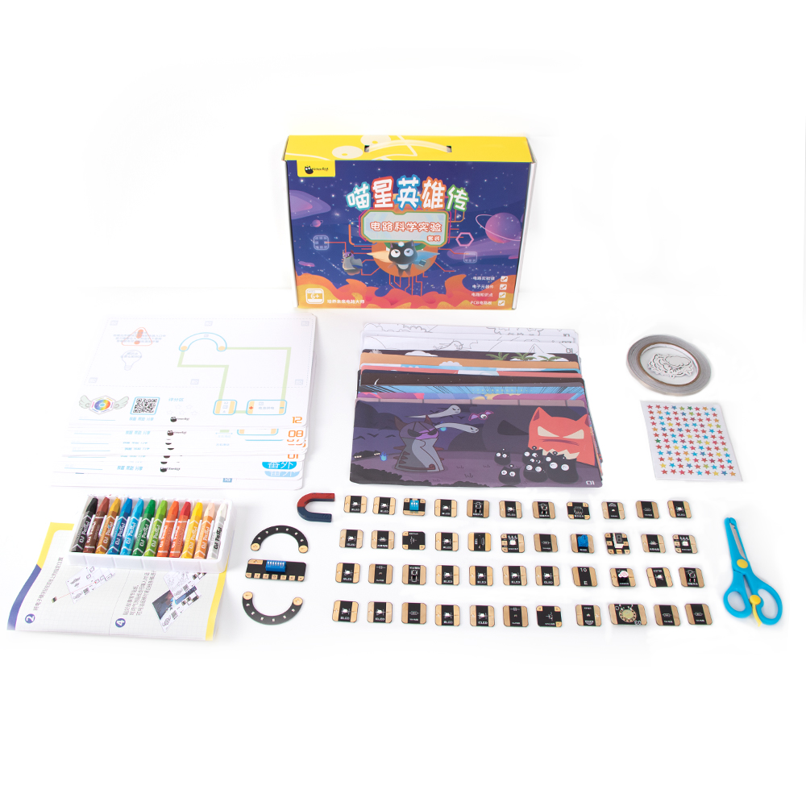
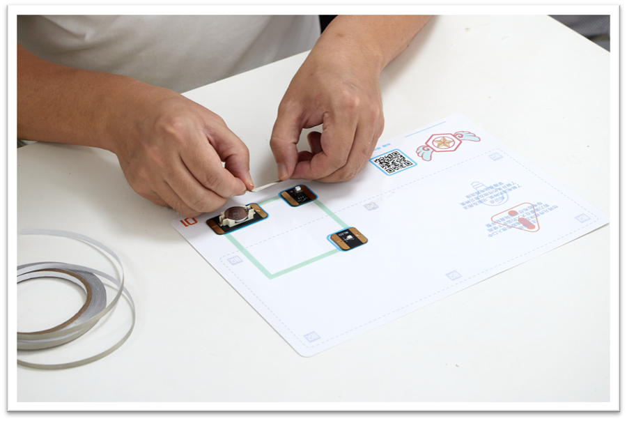
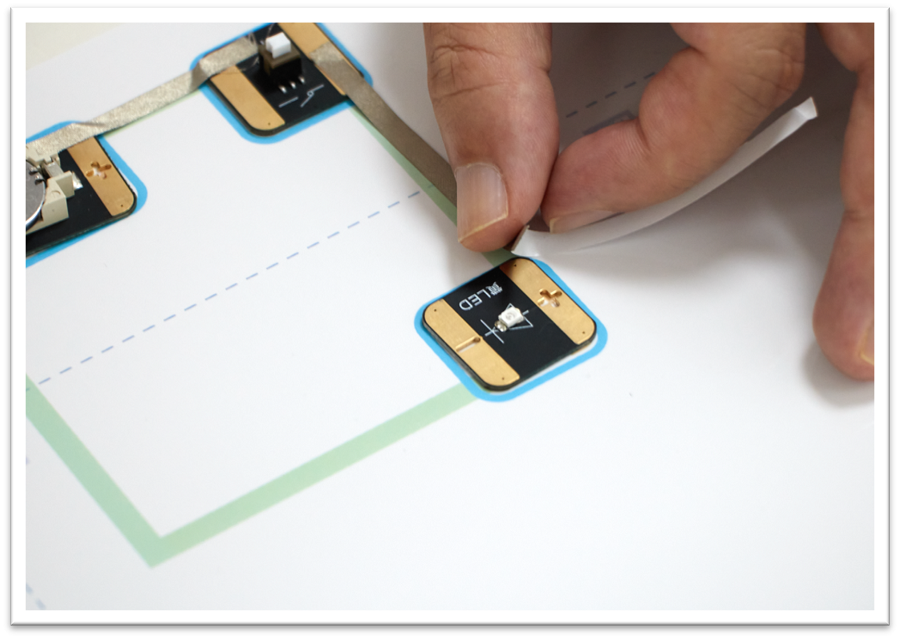
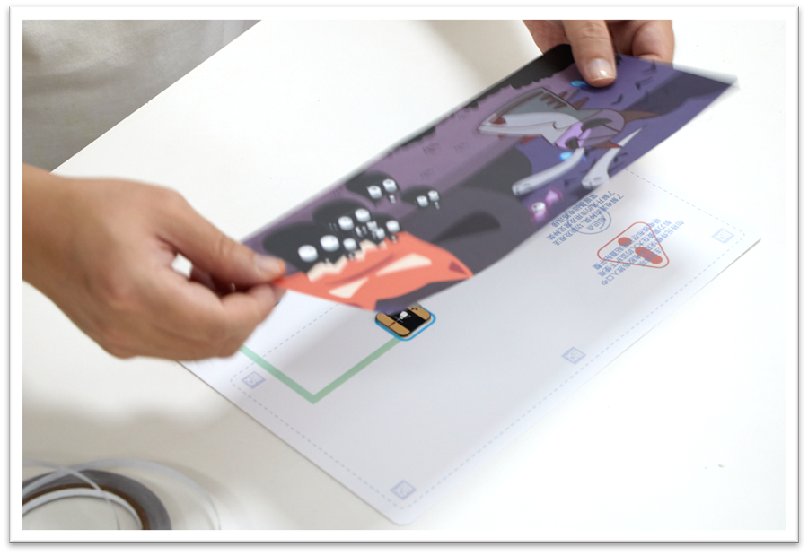
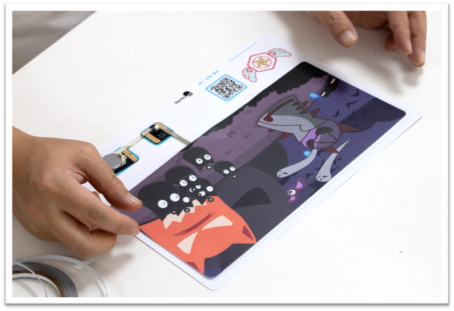
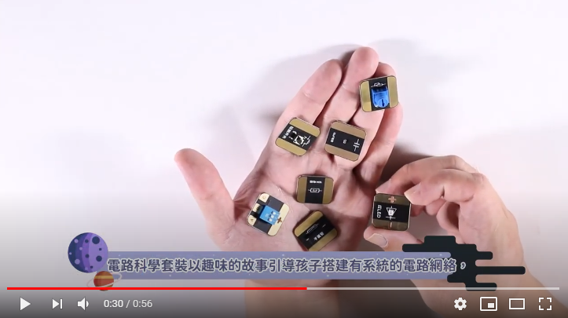

# 紙電路教學套件

為了針對市場上的STEM教育產品偏向適合高小至初中學生，比較難對年幼的學生進行STEM教育的情況，KittenBot現在推出紙電路教學套件。紙電路套件是專為初小設計的STEM教育套件，它的內容都是圍繞著光、聲、電的題材。

套件裏包含12個故事情境，配合導電膠布與總共47塊的電子元件，以生動有趣的故事形式令學生能夠輕鬆愉快地學習電路的知識、光與聲的原理還有如何搭建電路，為STEM教育打好基礎。

## 套件內容

1. 12塊故事情境紙板

2. 12張彩色故事圖畫

3. 12張黑白故事填色紙樣

4. 12包電子元件

5. 12粒鈕扣電池

6. 導電膠布

7. 雙面膠紙

8. 安全剪刀

9. 彩色粉彩筆

10. 對話框框貼紙

11. 1張貼紙

12. 4塊創意情景紙板

13. 4張立體紙樣

## 套件特色

- 適合初小的STEM教學套件

- 以生動有趣的故事貫穿12節課程

- 12包電子元件，總共47塊

- 不需要處理接線，只需將膠布依指示貼上

- 無需編程知識

- 學習基本電路知識

## 安全設計

- 採用CR2032大尺寸鋰電池，不怕小孩子誤吞

- 電路板圓角設計，不怕割傷小孩子

- 大尺寸電路板，不怕誤吞電池元件

- 電線膠布柔軟，不怕割傷孩子

- 配合安全剪刀，不怕剪傷

- 容易收納，每一節課都有獨立的元件包，不怕混亂

## 玩學過程

#### 1. 按照指引將元件粘貼在紙板上。

#### 2. 使用導電膠布連接電路。

#### 3. 將故事漫畫貼在紙板上。

### 4. 觀看效果。

## 介紹短片

