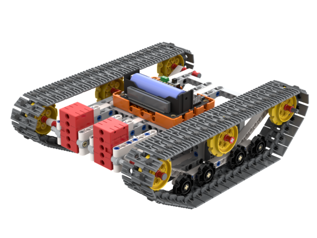
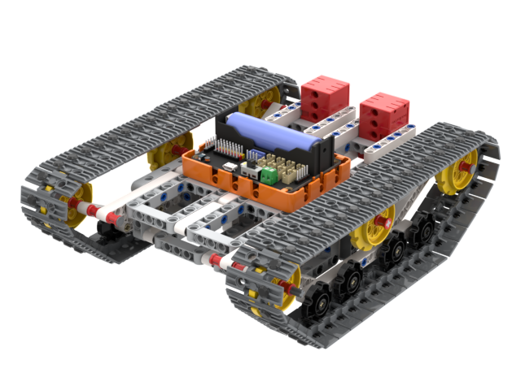
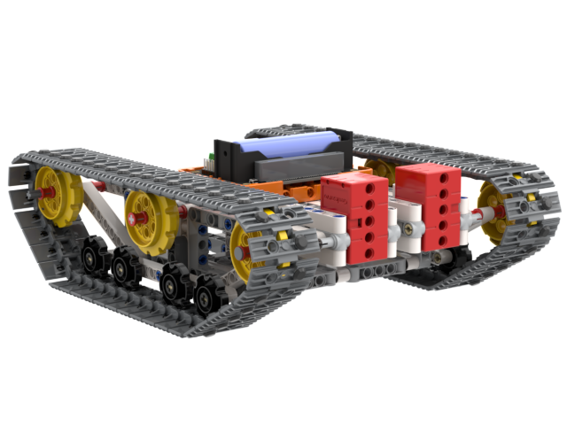

# 全地形越野遙控坦克

全地形越野遙控坦克是Kittenbot專為學校舉辦越野障礙賽而設計的遙控坦克。配備坦克履帶與2隻2KG電機，確保坦克有足夠動力攀山越嶺。

## 產品特色

- 基於Microbit的圖形化編程，更容易上手
- 兼容樂高積木，擴展性高
- 全方位移動，新穎兼靈活性高
- 使用2KG電機，性能強勁
- 支援MakeCode和Kittenblock編程

## 套件內容

- Robotbit Edu擴展板 x1
- 塑膠積木包 x1
- GeekServo 2KG電機 x2
- 18650鋰電池 x1

## 產品展示

