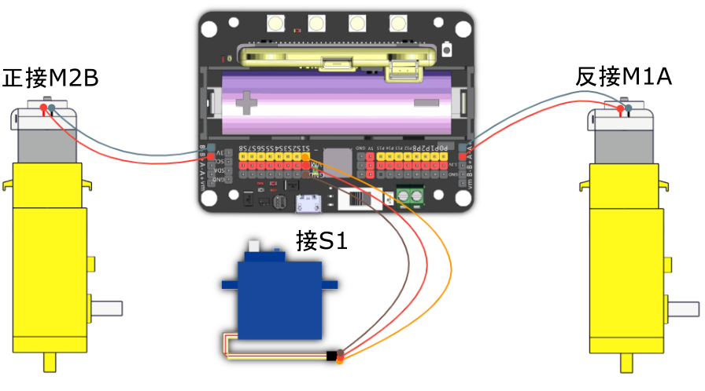

# MR STEMer Kart Lite套件

MR STEMer Kart Lite(HKBK6006A)

這是一款兼容micro:bit的巡線避障小車套件。

套件結合3D打印應用，製作極為輕巧的車身：配合簡易組裝，按配置組裝出具備避障與巡線功能的機械車，是為機械聘請學習的一個不錯選擇。

## 參考圖

## 套件內容

1. 貓耳超聲波感應模組
2. 超聲波模組支架
3. 5路巡線感應模組
4. T/T馬達x2
5. 9g舵機
6. 杜邦線
8. 3D打印車架
8. 3D打印馬達支架x2
9. 3D打印萬向珠支架
10. 萬向珠
11. 車輪x2
12. 巡線模組固定件
13. 螺絲及螺絲母

## 組裝教學

## 參考接線

## 參考程式

[Mr Stemer Kart Lite參考程式](https://makecode.microbit.org/_MkVb0A6ghiqC)

## 插件版本與更新

插件可能會不定時推出更新，改進功能。亦有時候我們可能需要轉用舊版插件才可使用某些功能。

詳情請參考: [Makecode插件版本更換](../Makecode/makecode_extensionUpdate)