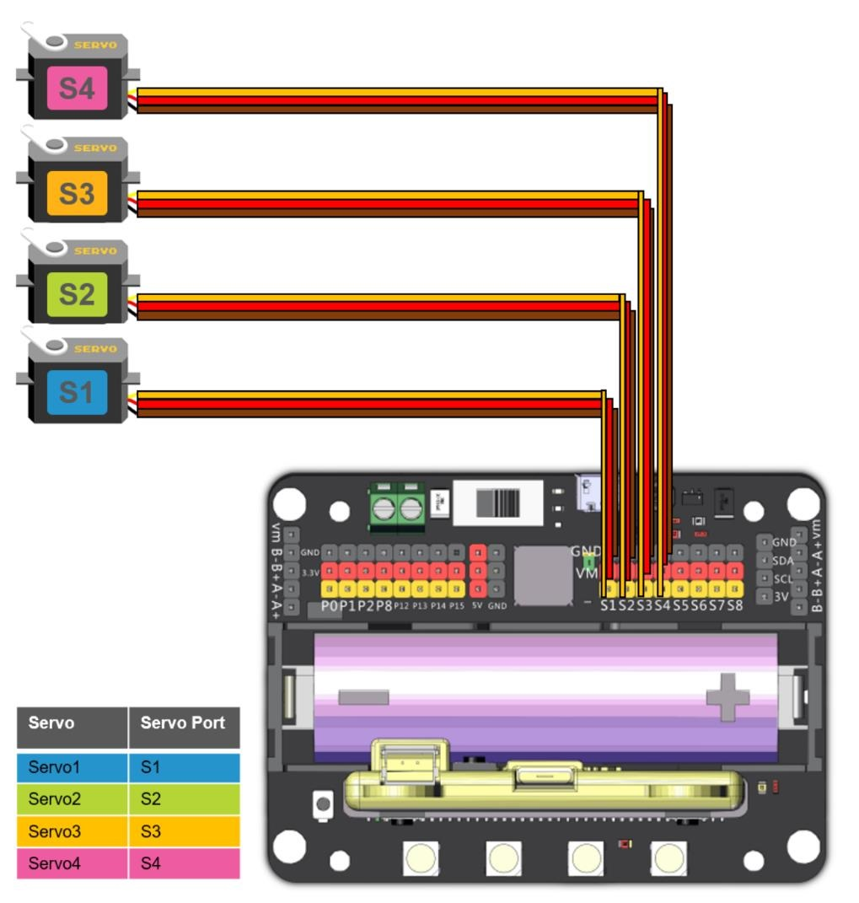

# Robotbit機械臂

Robotbit機械臂是一套機械套件，套件可以搭建出一隻以4隻大扭力金屬齒輪舵機驅動的活動機械臂。

## 套件內容

1. Robotbit Edu x1
2. 18650鋰電池 x1
3. MG995金屬齒輪舵機 x4
4. M3x8 螺絲 x28
5. M3x6 螺絲 x18
6. M3 絲帽 x24
7. 啤令 x2
8. 舵機轉向盤 x4
9. 機械爪 x1
10. 機械臂底座 x1
11. 直角角鐵 x1
12. U型角鐵 x2
13. 舵機底座 x2

## 套件特色

- 採用大扭力舵機，確保機械臂運作更加穩定可靠
- 機械結構讓學生了解機械臂例如槓桿力學等的機械工程知識。
- 動手搭建，讓學生動手組裝機械臂，提升工程技能

## 組裝教學

[下載組裝說明書](www.google.com)

[組裝說明短片](https://www.youtube.com/watch?v=qofKKztL0PU)

## 參考接線

## 參考程式

### 舵機校正程式

[校正程式](https://makecode.microbit.org/_J7XFYa2pDDPt)

### 機械臂參考程式

[參考程式](https://makecode.microbit.org/_Yfp13uUDEPrz)

## 插件版本與更新

插件可能會不定時推出更新，改進功能。亦有時候我們可能需要轉用舊版插件才可使用某些功能。

詳情請參考: [Makecode插件版本更換](../Makecode/makecode_extensionUpdate)