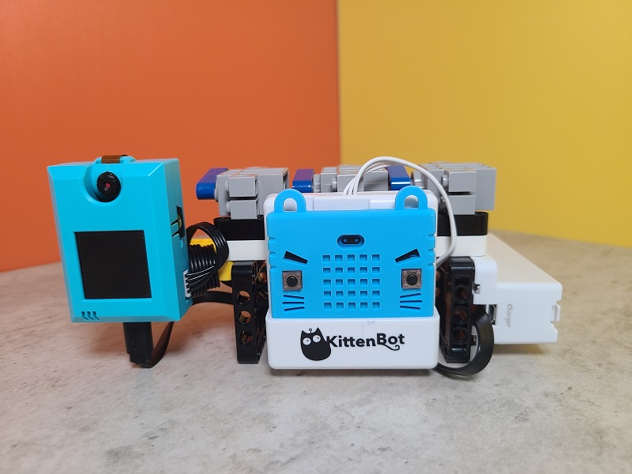
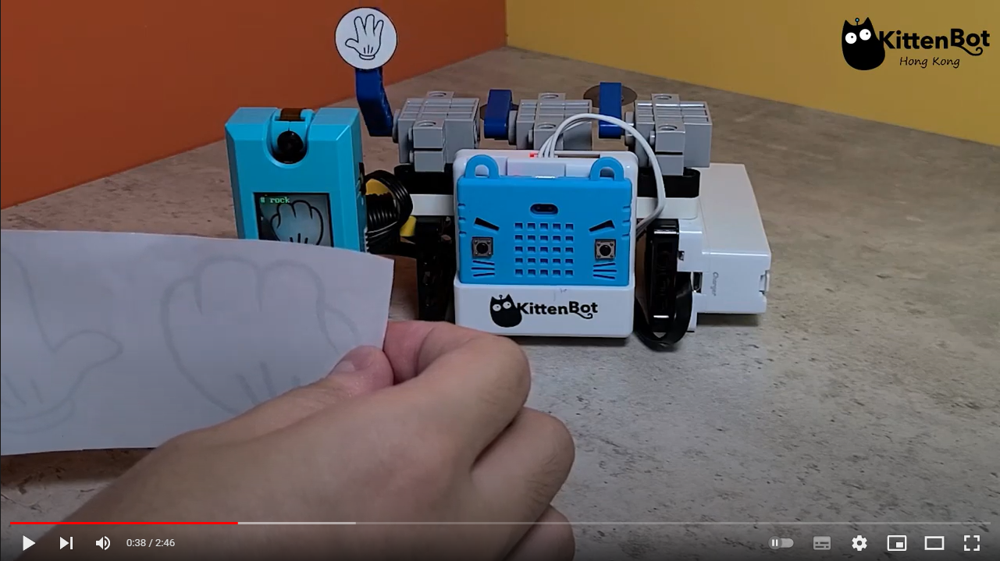
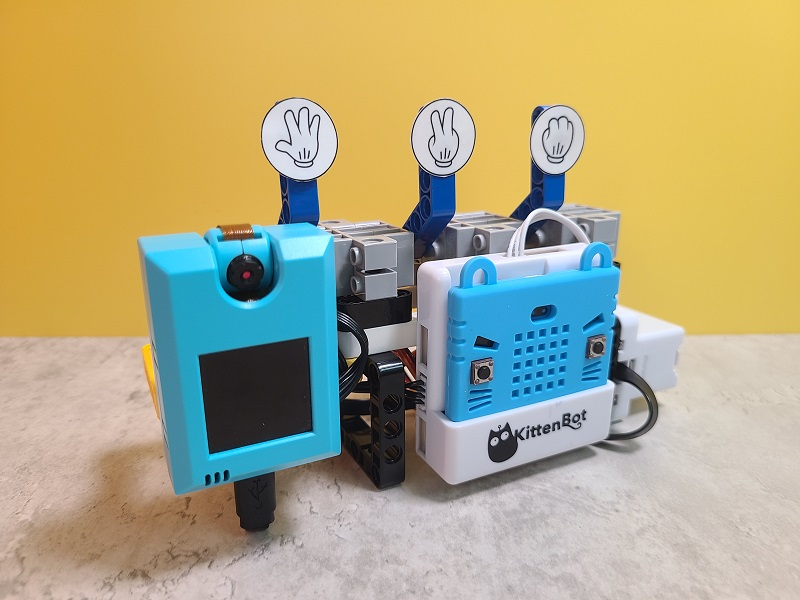
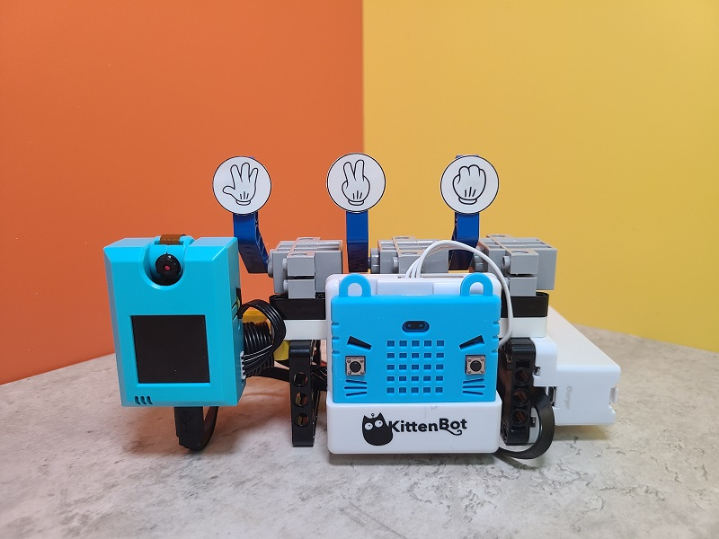
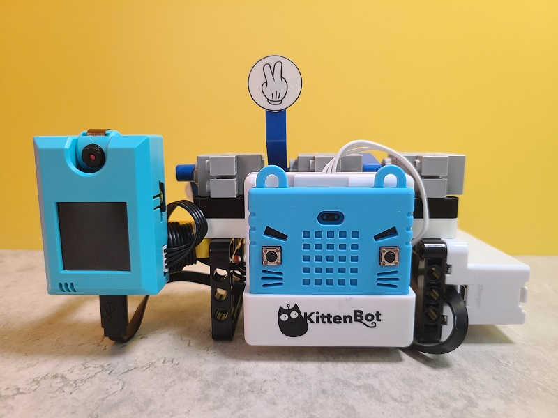

# AI猜拳無敵手

AI猜拳無敵手是使用KOI的機器學習功能令機械人能夠與用家玩猜拳遊戲的套件。

## 套件特色

- 結合AI與遊戲，令學生容易明白
- 兼容塑膠積木，輕易搭建美觀的應用案例
- 支援MakeCode編程

## 套件內容

- KOI鏡頭連128MB SD Card x1
- Armourbit+18650電池盒 x1
- GeekServo 9G舵機 x3
- 塑膠積木包 x1
- 18650鋰電池 x1
- 連接線 

## 示範短片

## 產品展示

