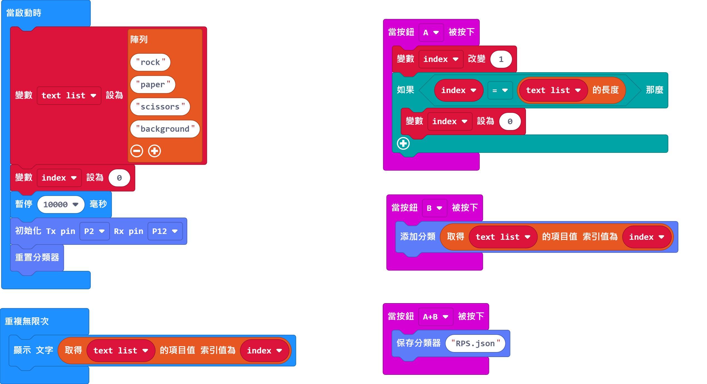
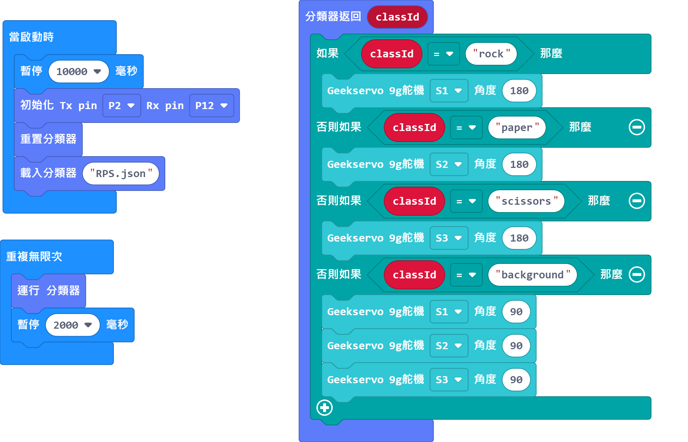

# AI猜拳無敵手套件教學

## 資源下載

[參考圖檔下載]()

## 參考程式下載

### 訓練程式

[訓練程式下載](https://makecode.microbit.org/_DTUWD84HF2jh)

### 訓練程式用法

1. Micro:bit會顯示現時的分類。
2. 按B可以令KOI對當前分類訓練。
3. 按A跳到下一個分類。
4. 按A+B儲存模型。

### 主程式

[訓練程式下載](https://makecode.microbit.org/_eXyPdqKbgeT1)

### 主程式用法

1. KOI辨認到圖樣之後就會自動舉起手勢牌。